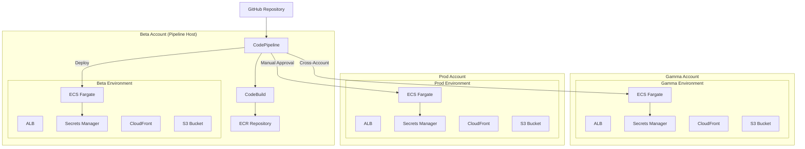
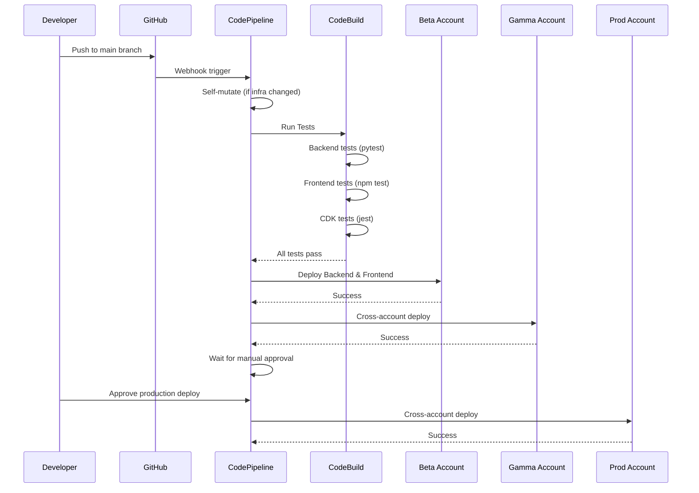
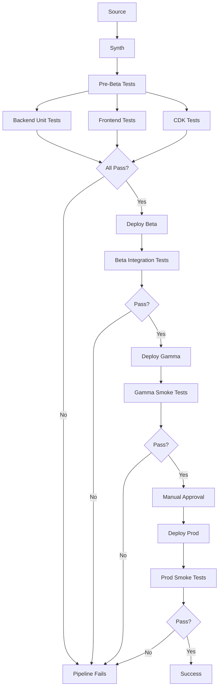
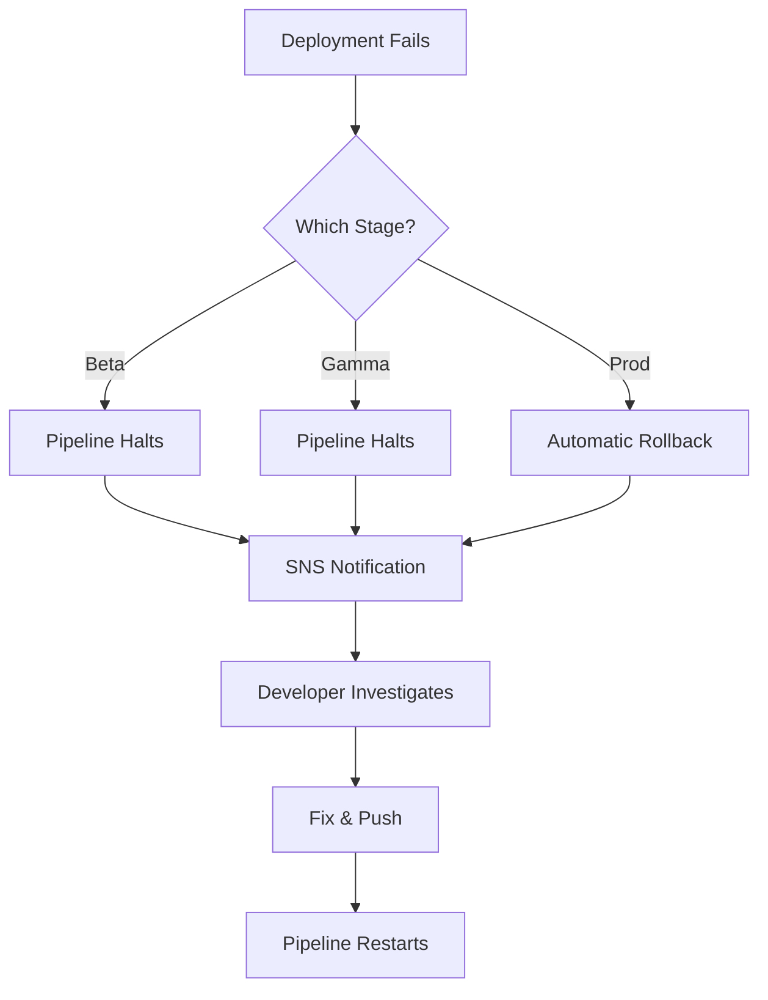
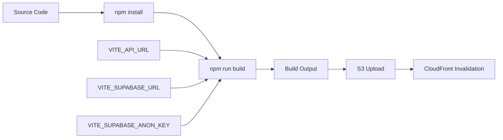

# Design Document: AWS Deployment Pipeline

## Overview

This design document describes the infrastructure and deployment architecture for the Canvalo application on AWS. The solution uses AWS CDK with CDK Pipelines to deploy a FastAPI backend on ECS Fargate and a React frontend on S3/CloudFront across three AWS accounts (Beta, Gamma, Prod).

The pipeline resides in the Beta account and deploys sequentially through environments with manual approval required before production deployment.

## Architecture

### High-Level Architecture Diagram



### Deployment Flow



### Automated Testing in Pipeline

The pipeline uses a hybrid testing approach:
1. **Full tests in Beta** - All unit, integration, and CDK tests run before/after Beta deployment
2. **Smoke tests in Gamma/Prod** - Health checks validate deployments work correctly

**Test Execution Flow:**



**Pre-Beta Tests (Full Suite):**

```typescript
// Backend unit tests
const backendTests = new pipelines.CodeBuildStep('BackendTests', {
  input: source,
  commands: [
    'cd strands-multi-agent-system',
    'pip install uv',
    'uv sync',
    'uv run pytest tests/ -v --tb=short',
  ],
  buildEnvironment: {
    buildImage: codebuild.LinuxBuildImage.STANDARD_7_0,
  },
});

// Frontend tests
const frontendTests = new pipelines.CodeBuildStep('FrontendTests', {
  input: source,
  commands: [
    'cd CanvaloFrontend',
    'npm ci',
    'npm test -- --run',  // --run for non-watch mode
  ],
});

// CDK tests
const cdkTests = new pipelines.CodeBuildStep('CDKTests', {
  input: source,
  commands: [
    'cd infrastructure',
    'npm ci',
    'npm test',
  ],
});
```

**Post-Deployment Tests:**

```typescript
// Beta integration tests (after Beta deployment)
const betaIntegrationTests = new pipelines.CodeBuildStep('BetaIntegrationTests', {
  commands: [
    'cd strands-multi-agent-system',
    'pip install uv',
    'uv sync',
    // Run integration tests against deployed Beta environment
    'uv run pytest tests/test_e2e.py -v --tb=short',
  ],
  envFromCfnOutputs: {
    API_URL: betaStage.apiUrl,  // Get Beta ALB URL from stack outputs
  },
});

// Gamma/Prod smoke tests (health checks)
const smokeTests = new pipelines.CodeBuildStep('SmokeTests', {
  commands: [
    // Health check - verify API is responding
    'curl -f ${API_URL}/health || exit 1',
    // Verify frontend is accessible
    'curl -f ${FRONTEND_URL} || exit 1',
  ],
  envFromCfnOutputs: {
    API_URL: stage.apiUrl,
    FRONTEND_URL: stage.frontendUrl,
  },
});
```

**Pipeline Stage Configuration:**

```typescript
// Beta stage with full testing
const betaStage = pipeline.addStage(new AppStage(this, 'Beta', betaConfig), {
  pre: [backendTests, frontendTests, cdkTests],  // Run before deployment
  post: [betaIntegrationTests],                   // Run after deployment
});

// Gamma stage with smoke tests
const gammaStage = pipeline.addStage(new AppStage(this, 'Gamma', gammaConfig), {
  post: [gammaSmokeTests],
});

// Prod stage with manual approval and smoke tests
const prodStage = pipeline.addStage(new AppStage(this, 'Prod', prodConfig), {
  pre: [new pipelines.ManualApprovalStep('PromoteToProd')],
  post: [prodSmokeTests],
});
```

**Test Failure Handling:**

- Pre-Beta test failure: Pipeline halts, no deployment to any environment
- Beta integration test failure: Pipeline halts after Beta, Gamma/Prod not deployed
- Gamma smoke test failure: Pipeline halts, Prod not deployed
- Prod smoke test failure: Pipeline marked as failed, alerts sent
- All failures trigger SNS notification to configured emails

## Components and Interfaces

### Repository Structure

The infrastructure is in a separate repository from the application code:

```
# Separate repositories:
canvalo-infrastructure/           # CDK infrastructure (NEW REPO)
├── bin/
│   └── app.ts                    # CDK app entry point
├── lib/
│   ├── stacks/
│   │   ├── backend-stack.ts      # ECS Fargate, ALB, VPC
│   │   ├── frontend-stack.ts     # S3, CloudFront
│   │   └── pipeline-stack.ts     # CDK Pipeline definition
│   ├── constructs/
│   │   ├── fargate-service.ts    # Reusable Fargate construct
│   │   ├── static-site.ts        # Reusable S3/CloudFront construct
│   │   └── secrets.ts            # Secrets Manager construct
│   └── config/
│       └── environments.ts       # Environment-specific configuration
├── cdk.json                      # CDK configuration
├── package.json
└── tsconfig.json

strands-multi-agent-system/       # Backend (EXISTING REPO)
├── backend/
├── agents/
├── tests/
├── Dockerfile                    # Backend container definition
└── pyproject.toml

CanvaloFrontend/                  # Frontend (EXISTING REPO)
├── src/
├── package.json
└── vite.config.ts
```

### Multi-Repository Pipeline

The CDK Pipeline will use CodeStar Connections to access multiple GitHub repositories:

```typescript
// Pipeline source configuration
const infraSource = pipelines.CodePipelineSource.connection(
  'your-org/canvalo-infrastructure',
  props.branch,
  { connectionArn: githubConnection.connectionArn }
);

const backendSource = pipelines.CodePipelineSource.connection(
  'your-org/strands-multi-agent-system',
  props.branch,
  { connectionArn: githubConnection.connectionArn }
);

const frontendSource = pipelines.CodePipelineSource.connection(
  'your-org/CanvaloFrontend',
  props.branch,
  { connectionArn: githubConnection.connectionArn }
);
```

### CDK Dependencies

**package.json:**

```json
{
  "name": "canvalo-infrastructure",
  "version": "1.0.0",
  "scripts": {
    "build": "tsc",
    "watch": "tsc -w",
    "test": "jest",
    "cdk": "cdk"
  },
  "devDependencies": {
    "@types/jest": "^29.5.12",
    "@types/node": "^20.14.0",
    "jest": "^29.7.0",
    "ts-jest": "^29.1.4",
    "typescript": "~5.4.5",
    "aws-cdk": "^2.150.0",
    "fast-check": "^3.19.0"
  },
  "dependencies": {
    "aws-cdk-lib": "^2.150.0",
    "constructs": "^10.3.0",
    "source-map-support": "^0.5.21"
  }
}
```

**Key CDK Modules Used:**

| Module | Purpose |
|--------|---------|
| `aws-cdk-lib/aws-ec2` | VPC, subnets, security groups |
| `aws-cdk-lib/aws-ecs` | ECS cluster, task definitions, services |
| `aws-cdk-lib/aws-ecs-patterns` | ApplicationLoadBalancedFargateService |
| `aws-cdk-lib/aws-ecr` | ECR repository for Docker images |
| `aws-cdk-lib/aws-ecr-assets` | Docker image building |
| `aws-cdk-lib/aws-elasticloadbalancingv2` | ALB configuration |
| `aws-cdk-lib/aws-s3` | S3 buckets for frontend and logs |
| `aws-cdk-lib/aws-s3-deployment` | Deploy frontend assets to S3 |
| `aws-cdk-lib/aws-cloudfront` | CloudFront distributions |
| `aws-cdk-lib/aws-cloudfront-origins` | S3 origin for CloudFront |
| `aws-cdk-lib/aws-certificatemanager` | ACM certificates for TLS |
| `aws-cdk-lib/aws-secretsmanager` | Secrets Manager references |
| `aws-cdk-lib/aws-sns` | SNS topics for notifications |
| `aws-cdk-lib/aws-sns-subscriptions` | Email subscriptions |
| `aws-cdk-lib/aws-cloudwatch` | CloudWatch alarms and dashboards |
| `aws-cdk-lib/aws-cloudwatch-actions` | Alarm actions (SNS) |
| `aws-cdk-lib/aws-logs` | CloudWatch log groups |
| `aws-cdk-lib/aws-iam` | IAM roles and policies |
| `aws-cdk-lib/pipelines` | CDK Pipelines for CI/CD |

**CDK CLI Version:** 2.150.0 or later (for latest CDK Pipelines features)

### Component Interfaces

#### Backend Stack

```typescript
interface BackendStackProps extends cdk.StackProps {
  environment: 'beta' | 'gamma' | 'prod';
  vpcCidr: string;
  taskCpu: number;
  taskMemory: number;
  minTasks: number;
  maxTasks: number;
  secretsArn: string;
  enableDeletionProtection: boolean;
}
```

#### Frontend Stack

```typescript
interface FrontendStackProps extends cdk.StackProps {
  environment: 'beta' | 'gamma' | 'prod';
  apiUrl: string;
  enableDeletionProtection: boolean;
}
```

#### Pipeline Stack

```typescript
interface PipelineStackProps extends cdk.StackProps {
  repositoryOwner: string;
  repositoryName: string;
  branch: string;              // Configurable branch (default: 'main')
  betaAccount: string;
  gammaAccount: string;
  prodAccount: string;
  notificationEmails: string[];
}
```

### Branch Configuration

The pipeline supports deploying from any branch, configured via CDK context.

**Default Configuration (main branch):**

```json
// cdk.json
{
  "context": {
    "branch": "main",
    "repositoryOwner": "your-org",
    "repositoryName": "canvalo"
  }
}
```

**Deploying a Different Branch:**

To deploy from a different branch (e.g., `old_ui_2`):

```bash
# Option 1: Override via command line
cdk deploy PipelineStack -c branch=old_ui_2

# Option 2: Update cdk.json and redeploy
# Edit cdk.json: "branch": "old_ui_2"
cdk deploy PipelineStack
```

**Branch Strategy Recommendations:**

| Branch | Purpose | Pipeline Behavior |
|--------|---------|-------------------|
| `main` | Production-ready code | Full pipeline: Beta → Gamma → Prod |
| `develop` | Integration branch | Could deploy to Beta only (optional) |
| `feature/*` | Feature development | Local testing only, no pipeline |
| `old_ui_2` | Legacy/alternate UI | Reconfigure pipeline to deploy this branch |

**Important Notes:**

1. Only one branch can be active in the pipeline at a time
2. Changing branches requires redeploying the pipeline stack
3. The pipeline self-mutates, so branch changes take effect on next push
4. For parallel branch deployments, you'd need separate pipeline stacks (advanced)

### Backend Container Interface

The Dockerfile exposes the following interface:

| Port | Protocol | Purpose |
|------|----------|---------|
| 8000 | HTTP | FastAPI application |

Environment variables consumed:
- `AWS_SECRETS_NAME` - Secrets Manager secret name (triggers cloud config mode)
- `ENVIRONMENT` - Environment name (beta/gamma/prod)
- `API_PORT` - Port to listen on (default: 8000)

### Secrets Manager Schema

Each account stores secrets with the following structure:

```json
{
  "SUPABASE_URL": "https://xxx.supabase.co",
  "SUPABASE_SERVICE_KEY": "eyJ...",
  "SUPABASE_ANON_KEY": "eyJ...",
  "BEDROCK_MODEL_ID": "amazon.nova-lite-v1:0",
  "AWS_REGION": "us-east-1"
}
```

### CORS Configuration

CORS headers are configured to allow the frontend to communicate with the backend API securely.

**Design Decision:** CORS is handled at the backend application level (FastAPI) rather than CloudFront, as the backend needs fine-grained control over allowed origins, methods, and headers.

**Backend CORS Configuration:**

The backend reads allowed origins from Secrets Manager and configures FastAPI CORS middleware:

```python
# In backend/main.py
from fastapi.middleware.cors import CORSMiddleware

app.add_middleware(
    CORSMiddleware,
    allow_origins=[settings.cors_allowed_origin],  # From Secrets Manager
    allow_credentials=True,
    allow_methods=["*"],
    allow_headers=["*"],
)
```

**Secrets Manager CORS Entry:**

```json
{
  "CORS_ALLOWED_ORIGIN": "https://canvalofrontend.{env}.{domain}"
}
```

| Environment | CORS_ALLOWED_ORIGIN |
|-------------|---------------------|
| Beta | `https://canvalofrontend.beta.canvalo.com` |
| Gamma | `https://canvalofrontend.gamma.canvalo.com` |
| Prod | `https://canvalofrontend.prod.canvalo.com` |

**Validates: Requirements 8.6**

## Design Decisions

This section documents key architectural decisions and their rationales.

### Decision 1: HTTPS for All Environments

**Context:** Requirements 8.2 and 8.4 originally specified HTTP with auto-generated ALB DNS names for Beta and Gamma environments.

**Decision:** Use HTTPS with custom domains for all environments (Beta, Gamma, Prod).

**Rationale:**
- Consistent security posture across all environments
- Simplifies frontend configuration (no HTTP/HTTPS switching)
- ACM certificates are free, so no additional cost
- Custom domains provide better developer experience and easier debugging
- Avoids mixed-content issues during development

**Trade-offs:**
- Requires Route53 hosted zone setup for each environment
- Slightly more complex initial setup

### Decision 2: CORS at Application Level

**Context:** Requirement 8.6 specifies CORS headers should be configured.

**Decision:** Handle CORS at the FastAPI backend level rather than CloudFront.

**Rationale:**
- Backend has fine-grained control over allowed origins, methods, and headers
- Easier to update CORS configuration via Secrets Manager without redeployment
- Follows the principle of handling security at the application layer
- CloudFront CORS configuration is more limited and harder to debug

### Decision 3: Local SNS Topics per Environment

**Context:** CloudWatch alarms need to send notifications for each environment.

**Decision:** Create local SNS topics in each account rather than cross-account notifications.

**Rationale:**
- Simpler IAM configuration (no cross-account SNS policies)
- Environment isolation for notifications
- Each environment can have different notification recipients if needed
- Easier to troubleshoot notification issues

### Decision 4: Pipeline in Beta Account

**Context:** Requirement 4.7 specifies the pipeline should reside in the Beta account.

**Decision:** Host the CDK Pipeline in the Beta account, deploying to Beta (same account), Gamma, and Prod (cross-account).

**Rationale:**
- Minimizes the number of AWS accounts required (no dedicated tooling account)
- Beta deployment is simpler (no cross-account IAM needed)
- Follows AWS best practices for smaller organizations

## Data Models

### Environment Configuration

```typescript
interface EnvironmentConfig {
  name: 'beta' | 'gamma' | 'prod';
  account: string;
  region: string;
  
  // Compute sizing
  taskCpu: 256 | 512 | 1024;      // vCPU units (256 = 0.25 vCPU)
  taskMemory: 512 | 1024 | 2048;  // MB
  minTasks: number;
  maxTasks: number;
  
  // Feature flags
  enableAutoScaling: boolean;
  enableDeletionProtection: boolean;
  requireManualApproval: boolean;
  
  // Networking
  vpcCidr: string;
}

const environments: Record<string, EnvironmentConfig> = {
  beta: {
    name: 'beta',
    account: process.env.BETA_ACCOUNT_ID!,
    region: 'us-east-1',
    taskCpu: 256,
    taskMemory: 512,
    minTasks: 1,
    maxTasks: 2,
    enableAutoScaling: false,
    enableDeletionProtection: false,
    requireManualApproval: false,
    vpcCidr: '10.0.0.0/16',
  },
  gamma: {
    name: 'gamma',
    account: process.env.GAMMA_ACCOUNT_ID!,
    region: 'us-east-1',
    taskCpu: 512,
    taskMemory: 1024,
    minTasks: 2,
    maxTasks: 4,
    enableAutoScaling: false,
    enableDeletionProtection: false,
    requireManualApproval: false,
    vpcCidr: '10.1.0.0/16',
  },
  prod: {
    name: 'prod',
    account: process.env.PROD_ACCOUNT_ID!,
    region: 'us-east-1',
    taskCpu: 1024,
    taskMemory: 2048,
    minTasks: 2,
    maxTasks: 10,
    enableAutoScaling: true,
    enableDeletionProtection: true,
    requireManualApproval: true,
    vpcCidr: '10.2.0.0/16',
  },
};
```

### Pipeline Stage Model

```typescript
interface PipelineStage {
  name: string;
  environment: EnvironmentConfig;
  preDeploymentSteps?: pipelines.Step[];
  postDeploymentSteps?: pipelines.Step[];
}
```


## Correctness Properties

*A property is a characteristic or behavior that should hold true across all valid executions of a system-essentially, a formal statement about what the system should do. Properties serve as the bridge between human-readable specifications and machine-verifiable correctness guarantees.*

Based on the acceptance criteria analysis, the following properties can be verified through CDK assertions and unit tests:

### Infrastructure Properties (CDK Assertions)

**Property 1: Environment-specific resource sizing**
*For any* environment configuration (beta, gamma, prod), the synthesized CloudFormation template SHALL contain ECS task definitions with the correct CPU and memory values as specified in the environment config.
**Validates: Requirements 7.1, 7.2, 7.3**

**Property 2: VPC multi-AZ configuration**
*For any* backend stack, the synthesized template SHALL create a VPC with subnets in at least 2 availability zones.
**Validates: Requirements 2.5**

**Property 3: Secrets Manager integration**
*For any* ECS task definition, the container definition SHALL reference Secrets Manager ARNs for sensitive configuration values, not hardcoded strings.
**Validates: Requirements 2.4, 5.2**

**Property 4: IAM least-privilege for secrets**
*For any* ECS task execution role, the IAM policy SHALL grant secretsmanager:GetSecretValue permission only to the specific secret ARN for that environment.
**Validates: Requirements 5.3**

**Property 5: Pipeline stage ordering**
*For any* CDK Pipeline, the stages SHALL be ordered as: Beta, Gamma, Prod, with Prod requiring manual approval.
**Validates: Requirements 4.2, 4.3**

**Property 6: Cross-account deployment configuration**
*For any* non-Beta stage in the pipeline, the deployment SHALL use cross-account IAM roles with the target account ID.
**Validates: Requirements 4.6, 4.8**

**Property 7: S3 bucket security**
*For any* frontend S3 bucket, the bucket SHALL have public access blocked and be accessible only via CloudFront OAI.
**Validates: Requirements 3.1**

**Property 8: CloudFront cache configuration**
*For any* CloudFront distribution, the default cache behavior SHALL have a TTL of 24 hours (86400 seconds).
**Validates: Requirements 3.3**

**Property 9: ALB TLS termination**
*For any* environment ALB listener, the listener SHALL use HTTPS (port 443) with an ACM certificate ARN and custom domain. All environments use custom subdomains (e.g., `api.beta.canvalo.com`, `api.gamma.canvalo.com`, `api.prod.canvalo.com`).
**Validates: Requirements 8.3, 8.5, 8.7**

**Design Decision:** The original requirements (8.2, 8.4) specified HTTP with auto-generated ALB DNS for Beta/Gamma. However, the implementation uses HTTPS with custom domains for all environments to simplify configuration and ensure consistent security posture. This is a deviation from the original requirements that provides better security without significant additional cost.

**Property 10: CloudWatch log retention**
*For any* ECS log group, the retention period SHALL be set to 30 days.
**Validates: Requirements 10.1**

**Property 11: Deletion protection for production**
*For any* prod environment stack, stateful resources (S3 buckets, log groups) SHALL have deletion protection or retain policies enabled.
**Validates: Requirements 7.6**

**Property 12: Auto-scaling configuration**
*For any* prod environment ECS service, auto-scaling SHALL be enabled with min=2 and max=10 tasks.
**Validates: Requirements 2.6**

**Property 13: CloudWatch alarms**
*For any* environment, CloudWatch alarms SHALL be configured for unhealthy task count and ALB 5xx error rate.
**Validates: Requirements 11.3, 11.4**

**Property 14: ALB access logging**
*For any* environment, the ALB SHALL have access logging enabled to an S3 bucket with appropriate lifecycle policies.
**Validates: Requirements 11.2**

**Property 15: CloudWatch dashboard (Prod only)**
*For any* prod environment, a CloudWatch dashboard SHALL exist with widgets for request count, latency, error rates, and task health.
**Validates: Requirements 11.5**

### Application Properties (Unit Tests)

**Property 16: Configuration source fallback**
*For any* backend startup, WHEN AWS_SECRETS_NAME is not set THEN configuration SHALL be loaded from environment variables and .env files; WHEN AWS_SECRETS_NAME is set THEN configuration SHALL be loaded from Secrets Manager.
**Validates: Requirements 9.1, 9.2, 9.3**

**Property 17: Environment-based auth enforcement**
*For any* ENVIRONMENT value, the backend SHALL enforce JWT authentication when ENVIRONMENT is "production" and allow optional authentication otherwise.
**Validates: Requirements 7.4**

## Error Handling

### Infrastructure Deployment Errors

| Error Scenario | Handling Strategy |
|----------------|-------------------|
| CDK synthesis fails | Pipeline fails at synth stage, no deployment occurs |
| Cross-account permission denied | Pipeline fails with IAM error, check bootstrap trust |
| Secrets Manager secret not found | ECS task fails to start, CloudWatch alarm triggers |
| ECR image pull fails | ECS task fails, service replaces task |
| Health check fails | ALB marks task unhealthy, ECS replaces task |

### Application Runtime Errors

| Error Scenario | Handling Strategy |
|----------------|-------------------|
| Secrets Manager unavailable | Retry with exponential backoff, fail startup after 3 attempts |
| Supabase connection fails | Return 503 with retry-after header |
| Bedrock throttling | Retry with backoff, return 429 to client |
| Invalid JWT | Return 401 with structured error response |

### Pipeline Failure Handling



### SNS Notifications

SNS topics are created in the Pipeline Account (Beta) to centralize notifications for all pipeline events.

**SNS Topic Structure:**

```typescript
interface NotificationConfig {
  // Main topic for pipeline notifications
  pipelineTopic: sns.Topic;
  
  // Email subscriptions
  subscriptions: sns.EmailSubscription[];
  
  // CloudWatch alarm actions
  alarmActions: cloudwatch.IAlarmAction[];
}
```

**Notification Events:**

| Event | Source | SNS Topic |
|-------|--------|-----------|
| Pipeline stage failed | CodePipeline | canvalo-pipeline-notifications |
| Manual approval required | CodePipeline | canvalo-pipeline-notifications |
| ECS unhealthy tasks | CloudWatch Alarm | canvalo-{env}-alarms |
| ALB 5xx errors | CloudWatch Alarm | canvalo-{env}-alarms |

**Implementation:**

```typescript
// Pipeline notifications (in Pipeline Account)
const pipelineNotificationTopic = new sns.Topic(this, 'PipelineNotifications', {
  topicName: 'canvalo-pipeline-notifications',
  displayName: 'Canvalo Pipeline Notifications',
});

// Email subscription
pipelineNotificationTopic.addSubscription(
  new subscriptions.EmailSubscription(props.notificationEmail)
);

// Pipeline notification rule
pipeline.notifyOn('PipelineFailure', pipelineNotificationTopic, {
  events: [
    pipelines.PipelineNotificationEvents.PIPELINE_EXECUTION_FAILED,
    pipelines.PipelineNotificationEvents.MANUAL_APPROVAL_NEEDED,
  ],
});

// Per-environment alarm topic (in each Stage Account)
const alarmTopic = new sns.Topic(this, 'AlarmNotifications', {
  topicName: `canvalo-${environment}-alarms`,
});

// CloudWatch alarm with SNS action
const unhealthyTasksAlarm = new cloudwatch.Alarm(this, 'UnhealthyTasks', {
  metric: service.metricCpuUtilization(),
  threshold: 80,
  evaluationPeriods: 2,
});
unhealthyTasksAlarm.addAlarmAction(new cw_actions.SnsAction(alarmTopic));
```

### ALB Access Logging

ALB access logs are stored in S3 for request analysis and troubleshooting.

**Implementation:**

```typescript
// S3 bucket for ALB access logs
const albLogsBucket = new s3.Bucket(this, 'AlbAccessLogs', {
  bucketName: `canvalo-${environment}-alb-logs`,
  encryption: s3.BucketEncryption.S3_MANAGED,
  blockPublicAccess: s3.BlockPublicAccess.BLOCK_ALL,
  lifecycleRules: [
    {
      expiration: cdk.Duration.days(90),  // Retain logs for 90 days
    },
  ],
  removalPolicy: environment === 'prod' 
    ? cdk.RemovalPolicy.RETAIN 
    : cdk.RemovalPolicy.DESTROY,
});

// Enable ALB access logging
loadBalancer.logAccessLogs(albLogsBucket, `alb-logs/${environment}`);
```

**Log Format:** ALB access logs include request timestamp, client IP, target IP, request processing time, response status codes, and request/response sizes.

**Validates: Requirements 11.2**

### CloudWatch Dashboard (Production)

A CloudWatch dashboard provides visibility into key application metrics for the production environment.

**Dashboard Widgets:**

| Widget | Metric | Description |
|--------|--------|-------------|
| Request Count | ALB RequestCount | Total requests per minute |
| Response Time | ALB TargetResponseTime | P50, P90, P99 latency |
| Error Rate | ALB HTTPCode_Target_5XX_Count | 5xx errors per minute |
| Task Health | ECS RunningTaskCount | Number of healthy tasks |
| CPU Utilization | ECS CPUUtilization | Average CPU across tasks |
| Memory Utilization | ECS MemoryUtilization | Average memory across tasks |

**Implementation:**

```typescript
// Production CloudWatch Dashboard
const dashboard = new cloudwatch.Dashboard(this, 'CanvaloDashboard', {
  dashboardName: 'canvalo-prod-dashboard',
});

dashboard.addWidgets(
  new cloudwatch.GraphWidget({
    title: 'Request Count',
    left: [loadBalancer.metricRequestCount()],
    width: 8,
  }),
  new cloudwatch.GraphWidget({
    title: 'Response Time',
    left: [
      loadBalancer.metricTargetResponseTime({ statistic: 'p50' }),
      loadBalancer.metricTargetResponseTime({ statistic: 'p90' }),
      loadBalancer.metricTargetResponseTime({ statistic: 'p99' }),
    ],
    width: 8,
  }),
  new cloudwatch.GraphWidget({
    title: 'Error Rate',
    left: [loadBalancer.metricHttpCodeTarget(HttpCodeTarget.TARGET_5XX_COUNT)],
    width: 8,
  }),
);

dashboard.addWidgets(
  new cloudwatch.GraphWidget({
    title: 'ECS Task Health',
    left: [service.metricCpuUtilization(), service.metricMemoryUtilization()],
    width: 12,
  }),
  new cloudwatch.SingleValueWidget({
    title: 'Running Tasks',
    metrics: [service.metric('RunningTaskCount')],
    width: 6,
  }),
);
```

**Validates: Requirements 11.5**

**Cross-Account Notifications:**

For Gamma and Prod accounts, alarms can either:
1. Send to a local SNS topic in that account (requires separate email subscription)
2. Send cross-account to the Pipeline Account's SNS topic (requires SNS policy)

Recommended approach: Local SNS topics per account with the same email subscription, keeping notifications isolated per environment.

**Email Configuration:**

The notification email is any existing email address you want to receive alerts. No special setup is required - just use your personal email, team email, or any email you have access to.

```typescript
// In cdk.json context or environment variable
{
  "context": {
    "notificationEmail": "your-email@example.com"  // Your actual email
  }
}

// Or via environment variable
const notificationEmail = process.env.NOTIFICATION_EMAIL;
```

**How it works:**
1. You provide your email address in the CDK configuration
2. When the pipeline stack deploys, AWS SNS creates a subscription
3. AWS sends a confirmation email to that address
4. You click "Confirm subscription" in the email (one-time step)
5. You start receiving pipeline notifications

**Configured Recipients:**

The pipeline will send notifications to:
- `peter.parianos@yahoo.com`
- `peter.parianos@canvalo.com`

```typescript
// In cdk.json context
{
  "context": {
    "notificationEmails": [
      "peter.parianos@yahoo.com",
      "peter.parianos@canvalo.com"
    ]
  }
}

// Implementation
const emails = this.node.tryGetContext('notificationEmails') as string[];
emails.forEach((email, index) => {
  pipelineNotificationTopic.addSubscription(
    new subscriptions.EmailSubscription(email)
  );
});
```

Both email addresses will receive a confirmation email when the stack is first deployed. Each recipient must click their own confirmation link to start receiving notifications.

## Testing Strategy

### Dual Testing Approach

This project uses both unit tests and property-based tests:

- **Unit tests**: Verify specific examples, edge cases, and integration points
- **Property-based tests**: Verify universal properties that should hold across all inputs

### CDK Infrastructure Testing

**Framework**: AWS CDK assertions (`aws-cdk-lib/assertions`)

CDK assertions allow us to verify the synthesized CloudFormation templates contain the expected resources and configurations without deploying.

```typescript
import { Template } from 'aws-cdk-lib/assertions';

// Example: Verify ECS task CPU/memory for an environment
const template = Template.fromStack(stack);
template.hasResourceProperties('AWS::ECS::TaskDefinition', {
  Cpu: '256',
  Memory: '512',
});
```

### Property-Based Testing

**Framework**: fast-check (TypeScript)

Property-based tests will verify that infrastructure properties hold across different environment configurations.

```typescript
import * as fc from 'fast-check';

// Example: Environment config property test
fc.assert(
  fc.property(
    fc.constantFrom('beta', 'gamma', 'prod'),
    (env) => {
      const config = getEnvironmentConfig(env);
      const stack = new BackendStack(app, `Backend-${env}`, config);
      const template = Template.fromStack(stack);
      
      // Verify CPU matches config
      template.hasResourceProperties('AWS::ECS::TaskDefinition', {
        Cpu: String(config.taskCpu),
      });
      return true;
    }
  ),
  { numRuns: 100 }
);
```

### Application Testing

**Framework**: pytest with hypothesis (Python)

The backend configuration module will be tested to ensure correct behavior across different configuration sources.

```python
from hypothesis import given, strategies as st

@given(st.booleans(), st.text(), st.text())
def test_config_source_selection(use_secrets_manager, secret_name, env_value):
    """
    Property: Configuration source is correctly selected based on AWS_SECRETS_NAME
    """
    # Test implementation
```

### Test Categories

| Category | Framework | Purpose |
|----------|-----------|---------|
| CDK Unit Tests | Jest + CDK assertions | Verify stack synthesis |
| CDK Property Tests | Jest + fast-check | Verify properties across environments |
| Backend Unit Tests | pytest | Verify config loading, error handling |
| Backend Property Tests | pytest + hypothesis | Verify config properties |
| Integration Tests | pytest | Verify deployed infrastructure |
| Monitoring Tests | Jest + CDK assertions | Verify alarms, dashboards, logging |

### Frontend Build and Deployment

The React frontend (CanvaloFrontend) requires environment-specific configuration at build time.

**Build Process:**



**Environment Variables Injected at Build:**

| Variable | Beta | Gamma | Prod |
|----------|------|-------|------|
| VITE_API_URL | `https://api.beta.{domain}` | `https://api.gamma.{domain}` | `https://api.prod.{domain}` |
| VITE_SUPABASE_URL | Shared Supabase URL | Shared Supabase URL | Shared Supabase URL |
| VITE_SUPABASE_ANON_KEY | From Secrets Manager | From Secrets Manager | From Secrets Manager |

**Note:** All environments use custom domains with ACM certificates and Route53 records. The domain structure follows the pattern `{service}.{env}.{domainName}` (e.g., `api.beta.canvalo.com`, `canvalofrontend.beta.canvalo.com`). Initially all environments share the same Supabase instance.

**Frontend Stack Components:**

```typescript
interface FrontendDeployment {
  // S3 bucket for static assets
  bucket: s3.Bucket;
  
  // CloudFront distribution
  distribution: cloudfront.Distribution;
  
  // Origin Access Identity for S3 access
  oai: cloudfront.OriginAccessIdentity;
  
  // Build output deployment
  deployment: s3deploy.BucketDeployment;
}
```

**CodeBuild for Frontend:**

The pipeline includes a CodeBuild step that:
1. Installs Node.js dependencies (`npm ci`)
2. Injects environment variables for the target environment
3. Builds the React app (`npm run build`)
4. Outputs the `dist/` folder for S3 deployment

```typescript
// Pipeline frontend build step
const frontendBuild = new pipelines.CodeBuildStep('FrontendBuild', {
  input: source,
  commands: [
    'cd CanvaloFrontend',
    'npm ci',
    'npm run build',
  ],
  env: {
    VITE_API_URL: apiUrl,
    VITE_SUPABASE_URL: supabaseUrl,
    VITE_SUPABASE_ANON_KEY: supabaseAnonKey,
  },
  primaryOutputDirectory: 'CanvaloFrontend/dist',
});
```

### Test File Structure

```
infrastructure/
├── test/
│   ├── unit/
│   │   ├── backend-stack.test.ts
│   │   ├── frontend-stack.test.ts
│   │   ├── pipeline-stack.test.ts
│   │   └── monitoring.test.ts          # Alarms, dashboard, ALB logging
│   └── property/
│       ├── environment-config.property.test.ts
│       ├── secrets-integration.property.test.ts
│       └── pipeline-stages.property.test.ts

strands-multi-agent-system/
├── tests/
│   ├── test_config_secrets.py          # Config loading tests
│   └── test_config_secrets_property.py # Property-based config tests

CanvaloFrontend/
├── src/
│   └── ...
├── vite.config.ts                      # Build configuration
└── package.json                        # Build scripts
```
