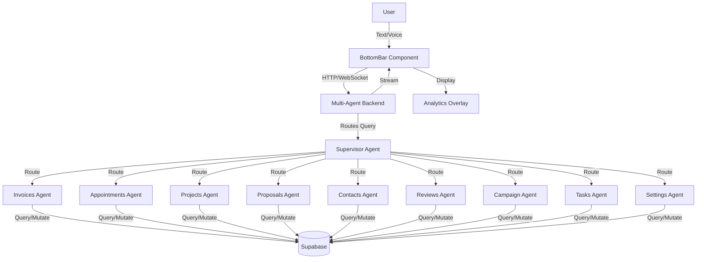

# Design Document

## Overview

This design document outlines the integration of a multi-agent AI system into Canvalo's existing chat bar interface. The system will migrate from the current AWS-focused multi-agent architecture (Orchestrator, Coder, Alarm Manager, AWS Researcher, AWS Manager) to a new business-focused architecture with 10 specialized agents handling different aspects of a painting contractor business.

The new system will:
- Rename the Orchestrator Agent to Supervisor Agent and adapt its routing logic
- Replace AWS-focused agents with business domain agents (Invoices, Appointments, Projects, Proposals, Contacts, Reviews, Campaigns, Tasks, Settings)
- Integrate with the existing React/TypeScript frontend through the BottomBar component
- Connect to Supabase for data persistence and retrieval
- Support both text and voice interactions with streaming responses
- Display analytics and charts inline within conversations

## Architecture

### High-Level Architecture



### Technology Stack

**Frontend:**
- React 18.3.1 with TypeScript
- Vite for bundling
- Tailwind CSS for styling
- **Axios** for HTTP requests and SSE streaming (with fetch adapter for browser streaming support)
- Supabase JS client for database operations
- Web Speech API for voice recognition
- Speech Synthesis API for text-to-speech

**Backend:**
- Python 3.13
- Strands Agents SDK (>=1.13.0) for agent framework
- Amazon Bedrock (Nova Lite/Pro or Claude Haiku 3.5) for LLM
- FastAPI for REST API endpoints
- Supabase for database and API
- Server-Sent Events (SSE) for streaming responses

**Infrastructure:**
- Supabase hosted database (PostgreSQL)
- AWS Bedrock for LLM inference
- FastAPI backend service
- Edge functions for backend logic (optional)

## Components and Interfaces

### Frontend Components

#### 1. BottomBar Component (Existing - To be Enhanced)

**Current State:**
- Handles text and voice input
- Displays messages in a chat interface
- Supports voice mode with Web Speech API
- Shows notifications
- Displays stat data overlays
- Has menu for navigation

**Required Enhancements:**
- Connect to real multi-agent backend instead of mock responses
- Handle streaming responses from LLM
- Support agent-specific UI elements (forms, confirmations)
- Display loading states during agent processing
- Handle error states from backend

**Interface:**
```typescript
interface BottomBarProps {
  activeView: string;
  onViewChange: (view: string) => void;
  onSendMessage: (message: string) => void;
  onVoiceStateChange?: (isActive: boolean, isListening: boolean, isSpeaking: boolean) => void;
  isChatOpen?: boolean;
  statData?: StatData | null;
  onCloseStatData?: () => void;
}

interface Message {
  id: string;
  content: string;
  role: 'user' | 'assistant';
  timestamp: Date;
  // agentType indicates which agent generated this response (for debugging and analytics)
  // Only present for assistant messages, not user messages
  agentType?: 'supervisor' | 'invoices' | 'appointments' | 'projects' | 'proposals' | 'contacts' | 'reviews' | 'campaigns' | 'tasks' | 'settings';
  metadata?: {
    toolCalls?: ToolCall[]; // List of tools called by the agent
    error?: string; // Error message if something went wrong
  };
}

interface ToolCall {
  name: string;
  arguments: Record<string, any>;
  result?: any;
}
```

**Purpose of agentType:**
The `agentType` field in the Message interface serves several purposes:
1. **Debugging:** Helps developers understand which agent handled a particular query
2. **Analytics:** Tracks which agents are most frequently used
3. **UI Customization:** Could be used to style messages differently based on agent (e.g., show an icon)
4. **Error Tracking:** Helps identify which agent is causing errors
5. **Future Features:** Could enable agent-specific actions or context menus

The field is optional and only populated for assistant messages (not user messages). It's set by the backend when an agent generates a response.

#### 2. AgentService (New)

**Purpose:** Manages communication between frontend and multi-agent backend using axios

**Responsibilities:**
- Send user messages to backend via axios
- Handle streaming responses using axios with `responseType: 'stream'` and fetch adapter
- Parse Server-Sent Events (SSE) from streaming responses
- Parse agent responses and tool calls
- Handle errors and retries with exponential backoff
- Manage conversation history via Supabase

**HTTP Client:** Uses **axios** for all HTTP requests, including SSE streaming support in the browser. Axios provides:
- Automatic request/response transformation
- Built-in retry and timeout support
- Better error handling with AxiosError
- Streaming support via `responseType: 'stream'` with fetch adapter
- Interceptor support for request/response middleware

**Interface:**
```typescript
class AgentService {
  constructor(config: AgentServiceConfig);
  
  // Send message and get streaming response via axios
  sendMessage(message: string, context: ConversationContext): AsyncGenerator<StreamChunk>;
  
  // Send voice transcript (delegates to sendMessage)
  sendVoiceMessage(transcript: string, context: ConversationContext): AsyncGenerator<StreamChunk>;
  
  // Get conversation history from Supabase
  getHistory(conversationId: string): Promise<Message[]>;
  
  // Create new conversation
  createConversation(userId: string, title?: string): Promise<string>;
  
  // Get all conversations for user
  getConversations(userId: string): Promise<Conversation[]>;
  
  // Clear/delete conversation
  clearConversation(conversationId: string): Promise<void>;
  
  // Cancel current streaming request
  cancelRequest(): void;
}

interface AgentServiceConfig {
  apiUrl: string;
  supabaseClient?: SupabaseClient;
  onError?: (error: Error) => void;
  maxRetries?: number;        // Default: 3
  baseRetryDelay?: number;    // Default: 1000ms
  maxRetryDelay?: number;     // Default: 10000ms
}

interface ConversationContext {
  conversationId: string;
  userId: string;
  history: Message[];
}

interface StreamChunk {
  type: 'token' | 'tool_call' | 'complete' | 'error';
  content?: string;
  toolCall?: ToolCall;
  error?: string;
  agentType?: AgentType;
}
```

**Axios Streaming Implementation:**
```typescript
// Example of axios streaming in sendMessage
const response = await this.axiosInstance.post('/chat/stream', payload, {
  responseType: 'stream',
  signal: this.abortController.signal,
  adapter: 'fetch', // Use fetch adapter for browser streaming
});

// Get the readable stream from the response
const stream = response.data as ReadableStream<Uint8Array>;
const reader = stream.getReader();

// Parse SSE chunks from the stream
yield* this.parseSSEStream(reader);
```

### Backend Components

#### 1. Supervisor Agent (Migrated from Orchestrator)

**Purpose:** Routes user queries to appropriate specialized agents

**System Prompt:**
```
You are the Supervisor Agent for Canvalo, a painting contractor business management system.
Your role is to analyze user queries and route them to the appropriate specialized agent.

Available agents:
- Invoices Agent: Handles invoice creation, viewing, updating, and payment tracking
- Appointments Agent: Manages scheduling, calendar, and appointment conflicts
- Projects Agent: Tracks painting projects, budgets, crew, and progress
- Proposals Agent: Creates and manages project proposals and estimates
- Contacts Agent: Manages client and supplier contact information
- Reviews Agent: Handles customer reviews, responses, and review requests
- Campaign Agent: Manages marketing campaigns (email/SMS)
- Tasks Agent: Tracks tasks, to-do items, and completion
- Settings Agent: Manages system configuration and business goals

Routing rules:
- Client/customer questions → Contacts Agent
- Project/job questions → Projects Agent
- Scheduling/appointment questions → Appointments Agent
- Proposal/estimate questions → Proposals Agent
- Invoice/billing questions → Invoices Agent
- Review/feedback questions → Reviews Agent
- Marketing/campaign questions → Campaign Agent
- Task/to-do questions → Tasks Agent
- Settings/goals/configuration questions → Settings Agent

When routing:
1. Identify the primary domain from the user's query
2. Pass the original query unchanged to the selected agent
3. Return the agent's response without modification
4. For multi-domain queries, coordinate multiple agents and merge responses
5. For ambiguous queries, ask clarifying questions before routing
```

**Tools:** All 9 specialized agents as callable tools

**Implementation Pattern:**
```python
from strands import Agent, tool
from strands.models import BedrockModel

# Import specialized agents
from invoices_agent import invoices_agent_tool
from appointments_agent import appointments_agent_tool
# ... other agents

supervisor_agent = Agent(
    model=BedrockModel(model_id="amazon.nova-lite-v1:0"),
    system_prompt=SUPERVISOR_SYSTEM_PROMPT,
    tools=[
        invoices_agent_tool,
        appointments_agent_tool,
        projects_agent_tool,
        proposals_agent_tool,
        contacts_agent_tool,
        reviews_agent_tool,
        campaigns_agent_tool,
        tasks_agent_tool,
        settings_agent_tool,
    ]
)
```

#### 2. Specialized Agents (9 New Agents)

Each specialized agent follows this pattern:

**Common Structure:**
```python
@tool
def {agent_name}_agent(query: str) -> str:
    """
    {Agent description and capabilities}
    """
    try:
        agent = Agent(
            model=BedrockModel(model_id="amazon.nova-lite-v1:0"),
            system_prompt=AGENT_SYSTEM_PROMPT,
            tools=[
                # Supabase tools for this domain
                get_{domain}_tool,
                create_{domain}_tool,
                update_{domain}_tool,
                delete_{domain}_tool,
            ]
        )
        response = agent(query)
        return str(response)
    except Exception as e:
        return f"Error in {agent_name}_agent: {str(e)}"
```

**Agent Specifications:**

**a) Invoices Agent**
- System Prompt: Expert in invoice management, billing, and payment tracking
- Tools: get_invoices, create_invoice, update_invoice, delete_invoice, send_invoice
- Supabase Tables: invoices, invoice_items, payments

**b) Appointments Agent**
- System Prompt: Expert in scheduling, calendar management, and availability
- Tools: get_appointments, create_appointment, update_appointment, delete_appointment, check_availability
- Supabase Tables: appointments, calendar_events

**c) Projects Agent**
- System Prompt: Expert in project management, tracking, budgets, and crew assignments
- Tools: get_projects, create_project, update_project, delete_project, get_project_analytics
- Supabase Tables: projects, project_tasks, project_crew, project_materials

**d) Proposals Agent**
- System Prompt: Expert in creating professional proposals with sections and pricing
- Tools: get_proposals, create_proposal, update_proposal, delete_proposal, calculate_totals
- Supabase Tables: proposals, proposal_sections, proposal_items

**e) Contacts Agent**
- System Prompt: Expert in contact and client relationship management
- Tools: get_contacts, create_contact, update_contact, delete_contact, search_contacts
- Supabase Tables: contacts, contact_notes

**f) Reviews Agent**
- System Prompt: Expert in customer review management and response drafting
- Tools: get_reviews, create_review_response, request_review, get_review_analytics
- Supabase Tables: reviews, review_responses

**g) Campaign Agent**
- System Prompt: Expert in marketing campaign creation and performance tracking
- Tools: get_campaigns, create_campaign, update_campaign, delete_campaign, get_campaign_analytics
- Supabase Tables: campaigns, campaign_recipients, campaign_metrics

**h) Tasks Agent**
- System Prompt: Expert in task management, priorities, and completion tracking
- Tools: get_tasks, create_task, update_task, delete_task, get_task_analytics
- Supabase Tables: tasks, task_assignments

**i) Settings Agent**
- System Prompt: Expert in system configuration, business goals, and preferences
- Tools: get_settings, update_settings, get_goals, update_goals, get_business_analytics
- Supabase Tables: user_settings, business_goals, system_config

#### 3. Supabase Tools (New)

Each agent needs tools to interact with Supabase. These tools wrap the Supabase client:

**Tool Pattern:**
```python
from supabase import create_client, Client
import os

supabase: Client = create_client(
    os.getenv("SUPABASE_URL"),
    os.getenv("SUPABASE_KEY")
)

@tool
def get_invoices(
    user_id: str,
    status: str = None,
    limit: int = 10
) -> str:
    """
    Fetch invoices from Supabase.
    
    Args:
        user_id: The user ID to fetch invoices for
        status: Optional status filter (draft, sent, paid, overdue)
        limit: Maximum number of invoices to return
    
    Returns:
        JSON string of invoices
    """
    try:
        query = supabase.table('invoices').select('*').eq('user_id', user_id)
        
        if status:
            query = query.eq('status', status)
        
        query = query.limit(limit).order('created_at', desc=True)
        
        result = query.execute()
        return json.dumps(result.data)
    except Exception as e:
        return json.dumps({"error": str(e)})
```

#### 4. Streaming Service (New)

**Purpose:** Handle streaming responses from LLM to frontend

**Implementation Options:**

**Option A: Server-Sent Events (SSE)**

**What is SSE?** Server-Sent Events is a standard web API that allows servers to push data to clients over HTTP. It's perfect for streaming AI responses because the server can send tokens one at a time as they're generated, and the client receives them in real-time.

*Pros:* Simple to implement, built-in browser support (`EventSource` API), automatic reconnection, works over HTTP, no special protocols needed
*Cons:* Unidirectional (server to client only), limited browser connection limits (6 per domain)

```python
from fastapi import FastAPI
from fastapi.responses import StreamingResponse
import asyncio

app = FastAPI()

@app.post("/api/chat/stream")
async def stream_chat(request: ChatRequest):
    async def generate():
        # Stream tokens from agent
        for chunk in supervisor_agent.stream(request.message):
            yield f"data: {json.dumps(chunk)}\n\n"
            await asyncio.sleep(0)
    
    return StreamingResponse(generate(), media_type="text/event-stream")
```

**Option B: WebSocket**

*Pros:* Bidirectional communication, low latency, persistent connection, no connection limits
*Cons:* More complex to implement, requires connection management, no automatic reconnection

```python
from fastapi import WebSocket

@app.websocket("/ws/chat")
async def websocket_chat(websocket: WebSocket):
    await websocket.accept()
    
    while True:
        message = await websocket.receive_text()
        
        # Stream response
        for chunk in supervisor_agent.stream(message):
            await websocket.send_json(chunk)
```

**Option C: WebRTC Data Channels**

*Pros:* Peer-to-peer capable, lowest latency, built-in encryption, supports binary data, NAT traversal
*Cons:* Most complex to implement, requires signaling server, browser compatibility considerations

```python
from aiortc import RTCPeerConnection, RTCSessionDescription, RTCDataChannel
from fastapi import FastAPI
import json

app = FastAPI()

# Store active peer connections
peer_connections = {}

@app.post("/api/webrtc/offer")
async def handle_offer(offer: dict):
    """Handle WebRTC offer from client"""
    pc = RTCPeerConnection()
    peer_id = str(uuid.uuid4())
    peer_connections[peer_id] = pc
    
    # Create data channel for streaming
    channel = pc.createDataChannel("chat")
    
    @channel.on("message")
    async def on_message(message):
        # Receive message from client
        request = json.loads(message)
        
        # Stream response through data channel
        for chunk in supervisor_agent.stream(request["message"]):
            channel.send(json.dumps(chunk))
    
    # Set remote description
    await pc.setRemoteDescription(RTCSessionDescription(
        sdp=offer["sdp"],
        type=offer["type"]
    ))
    
    # Create answer
    answer = await pc.createAnswer()
    await pc.setLocalDescription(answer)
    
    return {
        "peer_id": peer_id,
        "sdp": pc.localDescription.sdp,
        "type": pc.localDescription.type
    }

@app.post("/api/webrtc/ice")
async def handle_ice_candidate(peer_id: str, candidate: dict):
    """Handle ICE candidate from client"""
    pc = peer_connections.get(peer_id)
    if pc:
        await pc.addIceCandidate(candidate)
    return {"status": "ok"}
```

**Frontend WebRTC Client:**
```typescript
class WebRTCChatClient {
  private pc: RTCPeerConnection;
  private channel: RTCDataChannel;
  
  async connect(apiUrl: string) {
    this.pc = new RTCPeerConnection({
      iceServers: [{ urls: 'stun:stun.l.google.com:19302' }]
    });
    
    // Create data channel
    this.channel = this.pc.createDataChannel('chat');
    
    this.channel.onmessage = (event) => {
      const chunk = JSON.parse(event.data);
      this.onChunk(chunk);
    };
    
    // Create offer
    const offer = await this.pc.createOffer();
    await this.pc.setLocalDescription(offer);
    
    // Send offer to server
    const response = await fetch(`${apiUrl}/webrtc/offer`, {
      method: 'POST',
      headers: { 'Content-Type': 'application/json' },
      body: JSON.stringify({
        sdp: offer.sdp,
        type: offer.type
      })
    });
    
    const answer = await response.json();
    
    // Set remote description
    await this.pc.setRemoteDescription(new RTCSessionDescription({
      sdp: answer.sdp,
      type: answer.type
    }));
    
    // Handle ICE candidates
    this.pc.onicecandidate = async (event) => {
      if (event.candidate) {
        await fetch(`${apiUrl}/webrtc/ice`, {
          method: 'POST',
          headers: { 'Content-Type': 'application/json' },
          body: JSON.stringify({
            peer_id: answer.peer_id,
            candidate: event.candidate
          })
        });
      }
    };
  }
  
  sendMessage(message: string) {
    this.channel.send(JSON.stringify({ message }));
  }
  
  onChunk(chunk: StreamChunk) {
    // Handle incoming chunk
  }
}
```

**Option D: Bedrock Native Streaming Control**

**What is it?** The `strands-agents` library's `BedrockModel` class provides a built-in `streaming` configuration parameter that controls whether the model uses Bedrock's `converse_stream` API (streaming) or the standard `converse` API (non-streaming).

*Pros:* Native integration with Strands SDK, simple configuration flag, handles streaming at the model level, works seamlessly with agent framework
*Cons:* Still requires a transport mechanism (SSE/WebSocket) to deliver tokens to frontend, doesn't eliminate need for Options A-C

```python
from strands.models import BedrockModel

# Enable streaming (default)
streaming_model = BedrockModel(
    model_id="amazon.nova-lite-v1:0",
    streaming=True  # Uses converse_stream API
)

# Disable streaming (for batch processing or testing)
non_streaming_model = BedrockModel(
    model_id="amazon.nova-lite-v1:0",
    streaming=False  # Uses converse API
)

# The model's stream() method will behave accordingly
async for chunk in streaming_model.stream(messages):
    # Yields tokens incrementally when streaming=True
    # Yields complete response when streaming=False
    print(chunk)
```

**Use Cases for streaming=False:**
- Batch processing where latency isn't critical
- Testing and debugging (easier to inspect complete responses)
- Cost optimization (fewer API calls)
- When frontend doesn't support streaming UI

**Use Cases for streaming=True (default):**
- Interactive chat interfaces
- Real-time user feedback
- Long-form content generation
- Better perceived performance

**Recommended Option:** Use **Option D** to control Bedrock-level streaming behavior, combined with **Option A (SSE)** for transport. This gives you:
1. `streaming=True` in BedrockModel for token-by-token generation
2. SSE to deliver those tokens to the frontend in real-time
3. Simple implementation with built-in browser support

If bidirectional real-time communication becomes critical (e.g., for collaborative features or real-time voice), consider upgrading to **Option B (WebSocket)**. **Option C (WebRTC)** is best reserved for peer-to-peer scenarios or when ultra-low latency is required (e.g., real-time video/audio streaming).

## Data Models

### Frontend Models

```typescript
// Message model
interface Message {
  id: string;
  content: string;
  role: 'user' | 'assistant';
  timestamp: Date;
  agentType?: AgentType;
  metadata?: MessageMetadata;
}

type AgentType = 
  | 'supervisor'
  | 'invoices'
  | 'appointments'
  | 'projects'
  | 'proposals'
  | 'contacts'
  | 'reviews'
  | 'campaigns'
  | 'tasks'
  | 'settings';

interface MessageMetadata {
  toolCalls?: ToolCall[];
  error?: string;
  streamingComplete?: boolean;
}

// Conversation context
interface ConversationContext {
  conversationId: string;
  userId: string;
  history: Message[];
  metadata: {
    startedAt: Date;
    lastMessageAt: Date;
    messageCount: number;
  };
}

// Stream chunk
interface StreamChunk {
  type: 'token' | 'tool_call' | 'complete' | 'error';
  content?: string;
  toolCall?: ToolCall;
  error?: string;
  agentType?: AgentType;
}
```

### Backend Models

```python
from pydantic import BaseModel
from typing import List, Optional, Dict, Any
from datetime import datetime
from enum import Enum

class AgentType(str, Enum):
    SUPERVISOR = "supervisor"
    INVOICES = "invoices"
    APPOINTMENTS = "appointments"
    PROJECTS = "projects"
    PROPOSALS = "proposals"
    CONTACTS = "contacts"
    REVIEWS = "reviews"
    CAMPAIGNS = "campaigns"
    TASKS = "tasks"
    SETTINGS = "settings"

class Message(BaseModel):
    id: str
    content: str
    role: str  # 'user' or 'assistant'
    timestamp: datetime
    agent_type: Optional[AgentType] = None
    metadata: Optional[Dict[str, Any]] = None

class ChatRequest(BaseModel):
    message: str
    conversation_id: str
    user_id: str
    history: List[Message] = []

class ChatResponse(BaseModel):
    message: Message
    agent_type: AgentType
    tool_calls: List[Dict[str, Any]] = []

class StreamChunk(BaseModel):
    type: str  # 'token', 'tool_call', 'complete', 'error'
    content: Optional[str] = None
    tool_call: Optional[Dict[str, Any]] = None
    error: Optional[str] = None
    agent_type: Optional[AgentType] = None
```

### Supabase Schema

**Existing Tables (Already in Database):**
The following tables already exist and will be used by the specialized agents:
- `contacts` - Client/supplier management (Contacts Agent)
- `projects` - Project tracking (Projects Agent)
- `invoices` - Invoice management (Invoices Agent)
- `proposals` - Proposal creation (Proposals Agent)
- `appointments` - Scheduling (Appointments Agent)
- `reviews` - Customer reviews (Reviews Agent)
- `campaigns` - Marketing campaigns (Campaign Agent)
- `tasks` - Task management (Tasks Agent)
- `goals` - Business goals (Settings Agent)
- `conversations` - Client inbox messages (NOT for AI chat)

**New Tables Needed for Multi-Agent Chat:**

**Note:** All tables use the `api` schema (not `public`).

```sql
-- AI Chat Conversations table (separate from client conversations)
CREATE TABLE api.agent_conversations (
    id UUID PRIMARY KEY DEFAULT uuid_generate_v4(),
    user_id UUID NOT NULL REFERENCES auth.users(id),
    title TEXT, -- Optional conversation title
    created_at TIMESTAMP WITH TIME ZONE DEFAULT NOW(),
    updated_at TIMESTAMP WITH TIME ZONE DEFAULT NOW(),
    last_message_at TIMESTAMP WITH TIME ZONE,
    message_count INTEGER DEFAULT 0,
    metadata JSONB DEFAULT '{}'::jsonb
);

-- AI Chat Messages table
CREATE TABLE api.agent_messages (
    id UUID PRIMARY KEY DEFAULT uuid_generate_v4(),
    conversation_id UUID NOT NULL REFERENCES agent_conversations(id) ON DELETE CASCADE,
    content TEXT NOT NULL,
    role TEXT NOT NULL CHECK (role IN ('user', 'assistant')),
    agent_type TEXT CHECK (agent_type IN ('supervisor', 'invoices', 'appointments', 'projects', 'proposals', 'contacts', 'reviews', 'campaigns', 'tasks', 'settings')),
    metadata JSONB DEFAULT '{}'::jsonb, -- For tool calls, errors, etc.
    created_at TIMESTAMP WITH TIME ZONE DEFAULT NOW()
);

-- Indexes for performance
CREATE INDEX idx_agent_messages_conversation ON agent_messages(conversation_id, created_at DESC);
CREATE INDEX idx_agent_conversations_user ON agent_conversations(user_id, updated_at DESC);
CREATE INDEX idx_agent_messages_agent_type ON agent_messages(agent_type) WHERE agent_type IS NOT NULL;

-- Row Level Security (RLS) Policies
ALTER TABLE api.agent_conversations ENABLE ROW LEVEL SECURITY;
ALTER TABLE api.agent_messages ENABLE ROW LEVEL SECURITY;

-- Users can only see their own conversations
CREATE POLICY "Users can view own conversations"
    ON api.agent_conversations FOR SELECT
    USING (auth.uid() = user_id);

CREATE POLICY "Users can create own conversations"
    ON api.agent_conversations FOR INSERT
    WITH CHECK (auth.uid() = user_id);

CREATE POLICY "Users can update own conversations"
    ON api.agent_conversations FOR UPDATE
    USING (auth.uid() = user_id);

-- Users can only see messages in their conversations
CREATE POLICY "Users can view own messages"
    ON api.agent_messages FOR SELECT
    USING (
        EXISTS (
            SELECT 1 FROM api.agent_conversations
            WHERE agent_conversations.id = agent_messages.conversation_id
            AND agent_conversations.user_id = auth.uid()
        )
    );

CREATE POLICY "Users can create messages in own conversations"
    ON api.agent_messages FOR INSERT
    WITH CHECK (
        EXISTS (
            SELECT 1 FROM api.agent_conversations
            WHERE agent_conversations.id = agent_messages.conversation_id
            AND agent_conversations.user_id = auth.uid()
        )
    );

-- Function to update conversation metadata on new message
CREATE OR REPLACE FUNCTION update_conversation_on_message()
RETURNS TRIGGER AS $$
BEGIN
    UPDATE api.agent_conversations
    SET 
        updated_at = NOW(),
        last_message_at = NEW.created_at,
        message_count = message_count + 1
    WHERE id = NEW.conversation_id;
    RETURN NEW;
END;
$$ LANGUAGE plpgsql;

-- Trigger to automatically update conversation
CREATE TRIGGER update_conversation_on_message_trigger
    AFTER INSERT ON api.agent_messages
    FOR EACH ROW
    EXECUTE FUNCTION update_conversation_on_message();
```

**Note:** The existing `conversations` table is for client inbox messages (email/SMS conversations with clients), while `agent_conversations` is specifically for AI chat sessions. They serve different purposes and should remain separate.


## Correctness Properties

*A property is a characteristic or behavior that should hold true across all valid executions of a system-essentially, a formal statement about what the system should do. Properties serve as the bridge between human-readable specifications and machine-verifiable correctness guarantees.*

### Property 1: Correct Agent Routing by Domain

*For any* user query containing domain-specific keywords (contacts, projects, appointments, proposals, invoices, reviews, campaigns, tasks, settings), the Supervisor Agent should route to the corresponding specialized agent.

**Validates: Requirements 12.1, 12.2, 12.3, 12.4, 12.5, 12.6, 12.7, 12.8, 12.9**

### Property 2: Query Preservation During Routing

*For any* routing operation, the query passed to the specialized agent should be identical to the original user query (no modifications, truncations, or additions).

**Validates: Requirements 12.10**

### Property 3: Response Preservation from Agents

*For any* agent response, the Supervisor Agent should return the response to the user without modification (no filtering, summarization, or alteration).

**Validates: Requirements 12.11**

### Property 4: Multi-Agent Coordination

*For any* query requiring multiple domains, the Supervisor Agent should invoke all relevant specialized agents and merge their responses into a coherent narrative.

**Validates: Requirements 1.3**

### Property 5: Context Growth with Messages

*For any* message exchange (user message + assistant response), the conversation context should grow by exactly 2 messages in the correct order.

**Validates: Requirements 14.2**

### Property 6: Context Summarization at Token Limit

*For any* conversation context that exceeds the token limit, the system should summarize older messages while preserving recent messages, and the total token count should be below the limit.

**Validates: Requirements 14.3**

### Property 7: Historical Context Access

*For any* user query referencing previous information (using pronouns, "that", "the previous", etc.), agents should be able to retrieve relevant messages from conversation history.

**Validates: Requirements 14.4**

### Property 8: User-Friendly Error Messages

*For any* API call failure, the agent's response should contain a user-friendly explanation (no technical stack traces, error codes should be translated to plain language).

**Validates: Requirements 15.1**

### Property 9: LLM Retry with Exponential Backoff

*For any* LLM request failure, the system should retry up to 3 times with exponentially increasing delays (e.g., 1s, 2s, 4s) before returning an error.

**Validates: Requirements 15.2**

### Property 10: Invalid Data Error Explanation

*For any* invalid data input (missing required fields, wrong data types, constraint violations), the agent should explain what's wrong and what corrections are needed.

**Validates: Requirements 15.4**

### Property 11: Streaming Token Display

*For any* LLM response, tokens should appear incrementally in the Chat Bar as they are generated (not all at once after completion).

**Validates: Requirements 13.1**

## Error Handling

### Error Categories

**1. Network Errors**
- Connection failures
- Timeouts
- DNS resolution failures

**Handling Strategy:**
- Retry with exponential backoff (3 attempts)
- Queue messages for later delivery if offline
- Display user-friendly error message
- Provide option to retry manually

**2. API Errors**
- Supabase query failures
- Authentication errors
- Rate limiting
- Invalid requests

**Handling Strategy:**
- Log error details for debugging
- Translate error codes to user-friendly messages
- Suggest corrective actions
- For auth errors, prompt re-authentication

**3. LLM Errors**
- Model unavailable
- Token limit exceeded
- Content policy violations
- Timeout

**Handling Strategy:**
- Retry with exponential backoff
- Fall back to simpler model if available
- For token limits, summarize context and retry
- For policy violations, explain to user and request rephrasing

**4. Validation Errors**
- Missing required fields
- Invalid data types
- Constraint violations
- Business rule violations

**Handling Strategy:**
- Explain what's wrong in plain language
- Specify which fields need correction
- Provide examples of valid input
- Allow user to correct and resubmit

**5. Agent Errors**
- Agent initialization failures
- Tool execution errors
- Routing failures

**Handling Strategy:**
- Log error for debugging
- Provide fallback response
- Notify user of temporary unavailability
- Suggest alternative actions

### Error Response Format

```typescript
interface ErrorResponse {
  error: {
    code: string;
    message: string;
    userMessage: string;
    suggestedActions?: string[];
    retryable: boolean;
  };
}
```

### Retry Logic

```python
import asyncio
from typing import TypeVar, Callable

T = TypeVar('T')

async def retry_with_backoff(
    func: Callable[[], T],
    max_attempts: int = 3,
    base_delay: float = 1.0,
    max_delay: float = 10.0
) -> T:
    """
    Retry a function with exponential backoff.
    
    Args:
        func: The function to retry
        max_attempts: Maximum number of attempts
        base_delay: Initial delay in seconds
        max_delay: Maximum delay in seconds
    
    Returns:
        The result of the function
    
    Raises:
        The last exception if all attempts fail
    """
    last_exception = None
    
    for attempt in range(max_attempts):
        try:
            return await func()
        except Exception as e:
            last_exception = e
            
            if attempt < max_attempts - 1:
                delay = min(base_delay * (2 ** attempt), max_delay)
                await asyncio.sleep(delay)
    
    raise last_exception
```

## Testing Strategy

### Unit Testing

**Frontend Unit Tests:**
- AgentService message sending and streaming
- Message parsing and formatting
- Error handling and retry logic
- Context management
- Voice integration

**Backend Unit Tests:**
- Supervisor Agent routing logic
- Individual agent tool execution
- Supabase tool wrappers
- Error handling and retries
- Context summarization

**Test Framework:** Vitest for frontend, pytest for backend

### Property-Based Testing

**Property Testing Library:** fast-check for TypeScript, Hypothesis for Python

**Configuration:** Each property test should run a minimum of 100 iterations

**Test Tagging:** Each property-based test must include a comment with the format:
`// Feature: multi-agent-chat, Property {number}: {property_text}`

**Property Test Examples:**

```typescript
// Feature: multi-agent-chat, Property 1: Correct Agent Routing by Domain
import fc from 'fast-check';

test('routes queries to correct agent based on domain keywords', () => {
  fc.assert(
    fc.property(
      fc.record({
        domain: fc.constantFrom('contacts', 'projects', 'appointments', 'proposals', 'invoices', 'reviews', 'campaigns', 'tasks', 'settings'),
        query: fc.string({ minLength: 5, maxLength: 100 })
      }),
      ({ domain, query }) => {
        const queryWithKeyword = `${query} ${domain}`;
        const routedAgent = supervisorAgent.route(queryWithKeyword);
        
        const expectedAgent = `${domain}_agent`;
        expect(routedAgent).toBe(expectedAgent);
      }
    ),
    { numRuns: 100 }
  );
});
```

```python
# Feature: multi-agent-chat, Property 2: Query Preservation During Routing
from hypothesis import given, strategies as st

@given(st.text(min_size=1, max_size=500))
def test_query_preservation(original_query):
    """Test that queries are passed unchanged to specialized agents"""
    # Mock the specialized agent to capture the query it receives
    received_query = None
    
    def mock_agent(query: str) -> str:
        nonlocal received_query
        received_query = query
        return "mock response"
    
    # Route through supervisor
    supervisor.route(original_query, mock_agent)
    
    # Verify query was not modified
    assert received_query == original_query
```

### Integration Testing

**Scenarios to Test:**
1. End-to-end message flow (user input → supervisor → agent → Supabase → response)
2. Multi-agent coordination for complex queries
3. Streaming response delivery
4. Voice mode integration
5. Error recovery and retry
6. Context management across multiple messages
7. Analytics overlay triggering

**Test Environment:**
- Use Supabase test project with sample data
- Mock LLM responses for deterministic testing
- Test WebSocket/SSE connections

### Manual Testing

**Test Cases:**
1. Voice mode activation and permission handling
2. UI responsiveness during streaming
3. Analytics overlay display and interaction
4. Error message clarity and helpfulness
5. Multi-device testing (desktop, tablet, mobile)
6. Browser compatibility (Chrome, Safari, Firefox, Edge)

## Deployment Strategy

### Environment Configuration

**Environment Variables:**
```bash
# Frontend (.env)
VITE_SUPABASE_URL=https://your-project.supabase.co
VITE_SUPABASE_ANON_KEY=your-anon-key
VITE_AGENT_API_URL=https://your-backend.com/api

# Backend (.env)
SUPABASE_URL=https://your-project.supabase.co
SUPABASE_SERVICE_KEY=your-service-key
AWS_REGION=us-east-1
AWS_PROFILE=default
BEDROCK_MODEL_ID=amazon.nova-lite-v1:0
```

### Deployment Steps

**1. Migration Phase:**
- Deploy new backend alongside existing system
- Rename Orchestrator to Supervisor in codebase
- Remove old agent files (coder.py, alarm_manager.py, aws_researcher.py, aws_manager.py)
- Deploy new specialized agents
- Update supervisor routing logic
- Test routing with sample queries

**2. Database Setup:**
- Create Supabase tables for conversations and messages
- Set up Row Level Security (RLS) policies
- Create indexes for performance
- Seed test data

**3. Frontend Integration:**
- Update BottomBar to use AgentService
- Implement streaming response handling
- Add error handling UI
- Test voice mode integration

**4. Testing Phase:**
- Run unit tests
- Run property-based tests
- Execute integration tests
- Perform manual testing
- Load testing with concurrent users

**5. Production Deployment:**
- Deploy backend to production
- Deploy frontend to production
- Monitor error rates and performance
- Gradual rollout to users

### Monitoring and Logging

**Metrics to Track:**
- Message volume per agent
- Average response time
- Error rates by type
- Token usage and costs
- User satisfaction (implicit from retry rates)

**Logging Strategy:**
- Log all agent interactions with timestamps
- Log tool calls and results
- Log errors with full context
- Redact sensitive information (PII, API keys)
- Use structured logging (JSON format)

**Alerting:**
- Alert on error rate > 5%
- Alert on response time > 5 seconds
- Alert on LLM failures
- Alert on database connection issues

## Security Considerations

### Authentication and Authorization

**Frontend:**
- Use Supabase Auth for user authentication
- Store JWT tokens securely
- Refresh tokens before expiration
- Implement session timeout

**Backend:**
- Validate JWT tokens on every request
- Use Supabase service key for admin operations
- Implement rate limiting per user
- Validate user permissions before data access

### Data Privacy

**Conversation Data:**
- Encrypt sensitive data at rest in Supabase
- Use HTTPS/TLS for all communications
- Implement data retention policies
- Allow users to delete conversation history

**LLM Provider:**
- Use encrypted connections to Bedrock
- Do not send PII to LLM unless necessary
- Implement content filtering
- Log LLM requests for audit

### Input Validation

**User Input:**
- Sanitize all user input before processing
- Validate message length limits
- Check for malicious content
- Rate limit message sending

**Tool Arguments:**
- Validate all tool arguments before execution
- Use parameterized queries for database access
- Implement SQL injection prevention
- Validate file paths and prevent directory traversal

## Performance Optimization

### Caching Strategy

**Agent Responses:**
- Cache common queries and responses
- Use Redis or in-memory cache
- Set appropriate TTL (5-15 minutes)
- Invalidate cache on data updates

**Database Queries:**
- Use Supabase query caching
- Implement pagination for large result sets
- Use database indexes effectively
- Cache user profile data

### Streaming Optimization

**Token Streaming:**
- Use Server-Sent Events for simplicity
- Implement backpressure handling
- Buffer tokens for smooth display
- Optimize chunk size (10-20 tokens)

**Network Optimization:**
- Use HTTP/2 for multiplexing
- Compress responses with gzip
- Minimize payload size
- Use CDN for static assets

### Scalability

**Horizontal Scaling:**
- Deploy multiple backend instances
- Use load balancer for distribution
- Implement stateless design
- Share session state via Redis

**Database Scaling:**
- Use Supabase connection pooling
- Implement read replicas for queries
- Partition large tables by user_id
- Archive old conversations

## Future Enhancements

### Phase 2 Features

1. **Multi-modal Support:**
   - Image upload and analysis
   - Document parsing (PDFs, contracts)
   - Voice notes with transcription

2. **Advanced Analytics:**
   - Business intelligence dashboards
   - Predictive analytics for projects
   - Revenue forecasting

3. **Automation:**
   - Scheduled tasks and reminders
   - Automated follow-ups
   - Invoice payment reminders

4. **Integrations:**
   - Calendar sync (Google, Outlook)
   - Email integration
   - SMS notifications
   - Payment processing (Stripe)

5. **Collaboration:**
   - Team chat and mentions
   - Shared projects and tasks
   - Role-based permissions

### Technical Improvements

1. **Agent Improvements:**
   - Fine-tune models on business data
   - Implement agent memory and learning
   - Add agent-to-agent communication
   - Implement agent specialization

2. **Performance:**
   - Implement edge caching
   - Use WebAssembly for client-side processing
   - Optimize LLM inference
   - Reduce latency with regional deployments

3. **Reliability:**
   - Implement circuit breakers
   - Add health checks and monitoring
   - Implement graceful degradation
   - Add disaster recovery procedures
