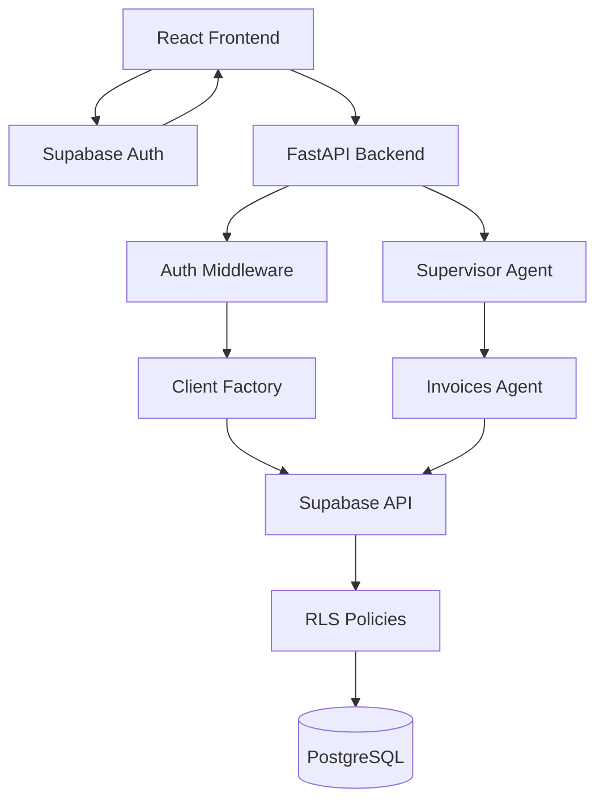

# Design Document - Production Security Implementation

## Overview

This design document outlines the architecture and implementation strategy for migrating the multi-agent system from an insecure secret-key-based approach to a production-ready, user-scoped authentication system with Row Level Security (RLS) enforcement. The migration addresses critical security vulnerabilities by ensuring that all database operations respect user data isolation through RLS policies, JWT-based authentication, and proper separation of concerns between development and production environments.

The design follows a phased approach that minimizes risk and allows for safe rollback at each stage. It encompasses database schema changes, backend API refactoring, frontend integration, testing infrastructure updates, and comprehensive monitoring and audit logging.

## Architecture

### Current Architecture (Insecure)

```
Frontend (No Auth)
    ↓
Backend API (Secret Key)
    ↓
Supabase (RLS Bypassed)
    ↓
PostgreSQL Database
```

**Problems:**
- Secret key bypasses all RLS policies
- No user data isolation
- Any user can access any other user's data
- Violates principle of least privilege
- Not suitable for production

### Target Architecture (Secure)

```
Frontend (Supabase Auth)
    ↓ (User JWT)
Backend API (JWT Validation)
    ↓ (User-Scoped Client)
Supabase (RLS Enforced)
    ↓
PostgreSQL Database (RLS Policies)
```

**Benefits:**
- User JWTs enforce RLS policies
- Database-level data isolation
- Users can only access their own data
- Principle of least privilege enforced
- Production-ready security

### Component Diagram



## Components and Interfaces

### 1. Auth Middleware

**Purpose:** Validate JWTs and extract user identity

**Location:** `backend/auth_middleware.py` (NEW FILE - to be created)

**Implementation:**
```python
"""
Authentication middleware for JWT validation.
"""
import os
import logging
from typing import Dict
from supabase import create_client, Client

logger = logging.getLogger(__name__)


class AuthenticationError(Exception):
    """Raised when JWT validation fails."""
    
    def __init__(self, message: str, code: str):
        self.message = message
        self.code = code
        self.user_message = self._get_user_message(code)
        super().__init__(self.message)
        
    def _get_user_message(self, code: str) -> str:
        """Get user-friendly error message."""
        messages = {
            "INVALID_TOKEN": "Your session is invalid. Please log in again.",
            "EXPIRED_TOKEN": "Your session has expired. Please log in again.",
            "MISSING_TOKEN": "Authentication required. Please log in.",
            "MALFORMED_TOKEN": "Invalid authentication format. Please log in again."
        }
        return messages.get(code, "Authentication error. Please try again.")


def validate_jwt(jwt_token: str) -> str:
    """
    Validate JWT token using Supabase Auth and extract user_id.
    
    This function uses Supabase's auth.get_user() method which:
    - Validates the JWT signature using the project's signing keys
    - Checks that the token hasn't expired
    - Verifies the token was issued by this Supabase project
    - Returns the user object if valid
    
    The auth.get_user() method is the recommended way to validate JWTs
    because it handles all verification logic server-side and validates
    against the project's JWKS (JSON Web Key Set).
    
    Args:
        jwt_token: JWT token from Authorization header
        
    Returns:
        user_id as UUID string (from the 'sub' claim)
        
    Raises:
        AuthenticationError: If token is invalid or expired
    """
    try:
        # Create Supabase client with pub key for JWT verification
        supabase_url = os.getenv("SUPABASE_URL")
        pub_key = os.getenv("SUPABASE_PUB_KEY")
        
        if not supabase_url or not pub_key:
            raise AuthenticationError(
                "Supabase configuration missing",
                "CONFIGURATION_ERROR"
            )
        
        # Create client for auth verification
        supabase = create_client(supabase_url, pub_key)
        
        # Verify JWT and get user using Supabase Auth
        # This validates the JWT signature, expiration, and issuer
        user_response = supabase.auth.get_user(jwt_token)
        
        if not user_response or not user_response.user:
            raise AuthenticationError(
                "Invalid JWT token",
                "INVALID_TOKEN"
            )
        
        # Extract user_id from the 'sub' claim
        user_id = user_response.user.id
        logger.info(f"JWT validated successfully for user {user_id}")
        
        return user_id
        
    except AuthenticationError:
        raise
    except Exception as e:
        logger.error(f"JWT validation failed: {str(e)}")
        raise AuthenticationError(
            f"JWT validation error: {str(e)}",
            "INVALID_TOKEN"
        )


def extract_user_id(jwt_token: str) -> str:
    """
    Extract user_id from validated JWT.
    
    This is a convenience function that validates and extracts in one step.
    
    Args:
        jwt_token: JWT token from Authorization header
        
    Returns:
        user_id as UUID string
        
    Raises:
        AuthenticationError: If token is invalid or expired
    """
    return validate_jwt(jwt_token)
```

**Note:** This file needs to be created as part of the implementation. It uses Supabase's `auth.get_user()` method to validate JWTs.

### 2. Supabase Client Wrapper

**Purpose:** Provide Supabase clients with appropriate authentication

**Location:** `utils/supabase_client.py`

**Current Implementation:** 
- Uses `SupabaseClientWrapper` singleton class with `SUPABASE_SERVICE_KEY` (bypasses RLS)
- Has `retry_with_backoff` decorator for retry logic
- Uses `schema("api")` for table queries
- Provides `table()`, `execute_query()`, and `health_check()` methods

**Required Updates:**

```python
class SupabaseClientWrapper:
    """Enhanced wrapper with user-scoped client support."""
    
    # EXISTING: Keep current _instance, _client, __new__, __init__, _initialize_client
    # EXISTING: Keep current client property, execute_query, table, health_check methods
    
    # NEW: Add user-scoped client creation
    def create_user_scoped_client(self, user_jwt: str) -> Client:
        """
        Create a Supabase client scoped to a specific user.
        This client respects RLS policies.
        
        Args:
            user_jwt: User's JWT token
            
        Returns:
            Supabase client configured with user JWT and pub key
        """
        supabase_url = os.getenv("SUPABASE_URL")
        pub_key = os.getenv("SUPABASE_PUB_KEY")
        
        if not pub_key:
            raise SupabaseConnectionError("SUPABASE_PUB_KEY not configured")
        
        return create_client(
            supabase_url=supabase_url,
            supabase_key=pub_key,
            options={
                "headers": {
                    "Authorization": f"Bearer {user_jwt}"
                }
            }
        )
    
    # NEW: Add key configuration verification
    def verify_key_configuration(self) -> dict:
        """
        Verify Supabase key configuration on startup.
        Logs warnings if using secret key or incorrect key type.
        
        Returns:
            dict with key_type, is_valid, warnings
        """
        supabase_key = os.getenv("SUPABASE_SERVICE_KEY")
        pub_key = os.getenv("SUPABASE_PUB_KEY")
        environment = os.getenv("ENVIRONMENT", "development")
        
        warnings = []
        
        if supabase_key and environment == "production":
            warnings.append("WARNING: SUPABASE_SERVICE_KEY is set in production - RLS will be bypassed")
            logger.warning("SUPABASE_SERVICE_KEY detected in production environment")
        
        if not pub_key:
            warnings.append("WARNING: SUPABASE_PUB_KEY not configured - user-scoped operations unavailable")
        
        return {
            "key_type": "service_key" if supabase_key else "pub_key",
            "is_valid": bool(pub_key),
            "warnings": warnings
        }

# EXISTING: Keep get_supabase_client() and get_client() functions unchanged
```

### 3. Agent Tools Interface

**Purpose:** Standardized interface for all agent tools

**Current Implementation (`agents/invoice_tools.py`):**
```python
# Current: user_id is optional with SYSTEM_USER_ID fallback
SYSTEM_USER_ID = os.getenv("SYSTEM_USER_ID", "00000000-0000-0000-0000-000000000000")

@tool
def get_invoices(
    user_id: Optional[str] = None,  # Optional with fallback
    status: Optional[str] = None,
    client_id: Optional[str] = None,
    limit: int = 10
) -> str:
    # Uses CURRENT_USER_ID env var or SYSTEM_USER_ID fallback
    if not user_id:
        user_id = os.getenv('CURRENT_USER_ID', SYSTEM_USER_ID)
    # Uses service key client (bypasses RLS)
    supabase = get_supabase_client()
```

**Required Updates:**
```python
@tool
def get_invoices(
    user_id: str,  # REQUIRED - no default
    user_jwt: Optional[str] = None,  # Optional - behavior depends on environment
    status: Optional[str] = None,
    client_id: Optional[str] = None,
    limit: int = 10
) -> str:
    """
    Fetch invoices for a specific user.
    RLS policies automatically filter by user_id.
    """
    environment = os.getenv("ENVIRONMENT", "development")
    
    if user_jwt:
        # Production path: Use user-scoped client with RLS enforcement
        supabase = get_supabase_client().create_user_scoped_client(user_jwt)
    elif environment == "development":
        # Development path: Use service key (bypasses RLS)
        logger.warning("Using service key - RLS bypassed (development mode)")
        supabase = get_supabase_client()
    else:
        # Production without JWT: Fail securely
        raise AuthenticationError("JWT required in production", "MISSING_TOKEN")
    
    # RLS automatically filters by user_id when using user-scoped client
    query = supabase.schema("api").table('invoices').select('*')
```

**All agent tools must:**
- Accept `user_id` as first parameter (required, no default)
- Accept optional `user_jwt` parameter
- Use `create_user_scoped_client(user_jwt)` when JWT is provided
- In production (`ENVIRONMENT=production`): Require JWT, fail if missing
- In development (`ENVIRONMENT=development`): Allow service key fallback with warning
- Rely on RLS policies for data filtering (remove manual `.eq('user_id', ...)` filters)

**Local Development Workflow:**
1. Set `ENVIRONMENT=development` in `.env`
2. Service key fallback is allowed (with logged warning)
3. RLS is bypassed in development for convenience
4. When testing RLS, use a test user JWT

**Production Security:**
- `ENVIRONMENT=production` enforces JWT requirement
- No fallback to service key
- All requests must be authenticated
- RLS policies are always enforced

### 4. Backend API Endpoints

**Purpose:** Handle agent requests with JWT authentication

**Current Implementation:** `backend/main.py` with FastAPI

**Current State:**
- `/api/chat/stream` accepts `ChatRequest` with `user_id` field (no JWT validation)
- `/api/conversations` endpoints use `user_id` query parameter (no JWT validation)
- CORS middleware configured for localhost origins
- Request logging middleware in place
- Exception handlers return structured error responses

**Required Updates:**

```python
from fastapi import Header, HTTPException
from backend.auth_middleware import validate_jwt, AuthenticationError

@app.post("/api/chat/stream")
async def stream_chat(
    request: ChatRequest,
    authorization: str = Header(None)  # NEW: Add authorization header
):
    """
    Stream chat responses from agents with JWT authentication.
    
    Headers:
        Authorization: Bearer <jwt_token>  # NEW
        
    Body:
        message: User's message
        conversation_id: Conversation ID
        user_id: User ID (will be validated against JWT)
        history: Message history
    """
    # NEW: 1. Extract JWT from Authorization header
    if not authorization or not authorization.startswith("Bearer "):
        raise HTTPException(status_code=401, detail="Missing or invalid authorization header")
    
    jwt_token = authorization.replace("Bearer ", "")
    
    # NEW: 2. Validate JWT and extract user_id
    try:
        validated_user_id = validate_jwt(jwt_token)
    except AuthenticationError as e:
        raise HTTPException(status_code=401, detail=e.user_message)
    
    # NEW: 3. Verify user_id in request matches JWT
    if request.user_id != validated_user_id:
        raise HTTPException(status_code=403, detail="User ID mismatch")
    
    # MODIFIED: 4. Pass JWT to chat service for user-scoped operations
    return StreamingResponse(
        chat_service.stream_chat_response(request, jwt_token),  # Add jwt_token parameter
        media_type="text/event-stream",
        headers={
            "Cache-Control": "no-cache",
            "Connection": "keep-alive",
            "X-Accel-Buffering": "no",
        }
    )
```

**Note:** The `ChatRequest` model already includes `user_id` field, so we just need to add JWT validation.

### 5. Frontend Integration

**Purpose:** Send authenticated requests to backend

**Location:** `CanvaloFrontend/src/services/AgentService.ts`

**Current Implementation:**
- Uses Axios with `baseURL` from config
- `sendMessage()` accepts `ConversationContext` with `userId`
- Sends `user_id` in request body (no Authorization header)
- Has retry logic with exponential backoff
- Handles SSE streaming responses

**Required Updates:**
```typescript
// NEW: Import Supabase client
import { supabase } from '../supabase/client';

class AgentService {
  // MODIFIED: Add JWT to sendMessage
  async *sendMessage(
    message: string,
    context: ConversationContext
  ): AsyncGenerator<StreamChunk> {
    // NEW: 1. Get user session from Supabase Auth
    const { data: { session } } = await supabase.auth.getSession();
    
    if (!session) {
      yield { type: 'error', error: 'User not authenticated. Please log in.' };
      return;
    }
    
    // MODIFIED: 2. Add Authorization header to request
    const response = await this.axiosInstance.post(
      '/chat/stream',
      {
        message,
        conversation_id: context.conversationId,
        user_id: context.userId,
        history: context.history.map(msg => ({...})),
      },
      {
        responseType: 'stream',
        signal: this.abortController.signal,
        adapter: 'fetch',
        headers: {
          'Authorization': `Bearer ${session.access_token}`  // NEW
        }
      }
    );
    // ... rest of streaming logic
  }
}
```

## Data Models

### Database Schema Changes

**Tables to Modify:**
- `api.invoices`
- `api.projects`
- `api.appointments`
- `api.proposals`
- `api.contacts`
- `api.reviews`
- `api.campaigns`
- `api.tasks`
- `api.goals`

**Schema Addition:**
```sql
-- Add user_id column
ALTER TABLE api.{table_name}
ADD COLUMN user_id UUID REFERENCES auth.users(id);

-- Create index for performance
CREATE INDEX idx_{table_name}_user_id ON api.{table_name}(user_id);

-- Make NOT NULL after backfill
ALTER TABLE api.{table_name}
ALTER COLUMN user_id SET NOT NULL;
```

### RLS Policy Pattern

**Standard RLS Policies for Each Table:**

```sql
-- Enable RLS
ALTER TABLE api.{table_name} ENABLE ROW LEVEL SECURITY;

-- SELECT policy
CREATE POLICY "Users can view own {records}"
ON api.{table_name} FOR SELECT
TO authenticated
USING (auth.uid() = user_id);

-- INSERT policy
CREATE POLICY "Users can create own {records}"
ON api.{table_name} FOR INSERT
TO authenticated
WITH CHECK (auth.uid() = user_id);

-- UPDATE policy
CREATE POLICY "Users can update own {records}"
ON api.{table_name} FOR UPDATE
TO authenticated
USING (auth.uid() = user_id)
WITH CHECK (auth.uid() = user_id);

-- DELETE policy
CREATE POLICY "Users can delete own {records}"
ON api.{table_name} FOR DELETE
TO authenticated
USING (auth.uid() = user_id);
```

### JWT Token Structure

**User JWT Claims:**
```json
{
  "sub": "user-uuid",
  "email": "user@example.com",
  "role": "authenticated",
  "iss": "supabase",
  "aud": "authenticated",
  "exp": 1234567890,
  "iat": 1234567890
}
```

**Extraction:**
- `sub` claim contains the user_id
- `role` must be "authenticated" for user operations
- `exp` must be validated to ensure token hasn't expired

### Environment Configuration

**Current Development (.env):**
```bash
# Supabase Configuration (CURRENT)
SUPABASE_URL=https://project.supabase.co
SUPABASE_SERVICE_KEY=sb_secret_...  # Secret key - bypasses RLS

# AWS Configuration
AWS_REGION=us-east-1
AWS_PROFILE=default

# Bedrock Configuration
BEDROCK_MODEL_ID=amazon.nova-lite-v1:0

# API Configuration
API_HOST=0.0.0.0
API_PORT=8000
```

**Target Development (.env) - After Migration:**
```bash
# Supabase Configuration
SUPABASE_URL=https://project.supabase.co
SUPABASE_PUB_KEY=eyJhbGci...  # NEW: Anon key for user operations
SUPABASE_SERVICE_KEY=sb_secret_...  # Secret key for system operations (dev only)

# AWS Configuration
AWS_REGION=us-east-1
AWS_PROFILE=default

# Bedrock Configuration
BEDROCK_MODEL_ID=amazon.nova-lite-v1:0

# API Configuration
API_HOST=0.0.0.0
API_PORT=8000

# NEW: Environment settings
ENVIRONMENT=development
SYSTEM_USER_ID=00000000-0000-0000-0000-000000000000
```

**Target Production (.env.production):**
```bash
# Supabase Configuration
SUPABASE_URL=https://project.supabase.co
SUPABASE_PUB_KEY=eyJhbGci...  # Anon key only
# SUPABASE_SERVICE_KEY removed in production

# AWS Configuration
AWS_REGION=us-east-1

# Bedrock Configuration
BEDROCK_MODEL_ID=amazon.nova-lite-v1:0

# API Configuration
API_HOST=0.0.0.0
API_PORT=8000

# Environment
ENVIRONMENT=production
```

## Error Handling

### Authentication Errors

**JWT Validation Failures:**
```python
class AuthenticationError(Exception):
    """Raised when JWT validation fails."""
    
    def __init__(self, message: str, code: str):
        self.message = message
        self.code = code
        self.user_message = self._get_user_message(code)
        
    def _get_user_message(self, code: str) -> str:
        messages = {
            "INVALID_TOKEN": "Your session is invalid. Please log in again.",
            "EXPIRED_TOKEN": "Your session has expired. Please log in again.",
            "MISSING_TOKEN": "Authentication required. Please log in.",
            "MALFORMED_TOKEN": "Invalid authentication format. Please log in again."
        }
        return messages.get(code, "Authentication error. Please try again.")
```

**Error Response Format:**
```json
{
  "error": {
    "code": "EXPIRED_TOKEN",
    "message": "JWT token has expired",
    "userMessage": "Your session has expired. Please log in again.",
    "suggestedActions": ["Log in again", "Refresh your session"],
    "retryable": false
  }
}
```

### RLS Policy Violations

**Detection:**
- Empty result sets when data should exist
- INSERT/UPDATE/DELETE operations that affect 0 rows
- Permission denied errors from PostgreSQL

**Logging:**
```python
def log_rls_violation(
    user_id: str,
    table: str,
    operation: str,
    attempted_record_id: str
):
    """Log potential RLS policy violation."""
    logger.warning(
        f"RLS violation attempt: user={user_id} table={table} "
        f"operation={operation} record={attempted_record_id}",
        extra={
            "security_event": True,
            "event_type": "rls_violation",
            "user_id": user_id,
            "table": table,
            "operation": operation
        }
    )
```

### Rate Limiting Errors

**Implementation:**
```python
from slowapi import Limiter
from slowapi.util import get_remote_address

limiter = Limiter(key_func=get_remote_address)

@app.post("/api/chat/stream")
@limiter.limit("10/minute")
async def chat_stream(request: Request):
    # Handle request
    pass
```

**Error Response:**
```json
{
  "error": {
    "code": "RATE_LIMIT_EXCEEDED",
    "message": "Too many requests",
    "userMessage": "You've made too many requests. Please wait a moment.",
    "retryAfter": 45,
    "retryable": true
  }
}
```

## Testing Strategy

### Unit Testing

**Test Categories:**

1. **JWT Validation Tests**
   - Valid JWT tokens are accepted
   - Expired tokens are rejected
   - Malformed tokens are rejected
   - Missing tokens are rejected
   - User ID extraction works correctly

2. **Supabase Client Factory Tests**
   - User-scoped clients are created correctly
   - Anon key is used with user JWT
   - Secret key usage logs warnings
   - Configuration validation works

3. **Agent Tool Tests**
   - Tools accept user_id parameter
   - Tools create user-scoped clients
   - Tools handle missing user_id appropriately
   - RLS filtering works correctly

**Testing Framework:** pytest

**Example Test:**
```python
def test_validate_jwt_with_valid_token():
    """Test JWT validation with valid token."""
    token = create_test_jwt(user_id="test-user-123")
    result = validate_jwt(token)
    assert result["user_id"] == "test-user-123"
    assert result["role"] == "authenticated"

def test_validate_jwt_with_expired_token():
    """Test JWT validation rejects expired token."""
    token = create_expired_jwt()
    with pytest.raises(AuthenticationError) as exc:
        validate_jwt(token)
    assert exc.value.code == "EXPIRED_TOKEN"
```

### Property-Based Testing

**Property Testing Library:** Hypothesis (Python)

**Test Strategy:**
- Generate random user IDs, JWTs, and data
- Verify RLS policies hold across all inputs
- Test data isolation between users
- Validate authentication flows

### Integration Testing

**Test Scenarios:**

1. **Multi-User Data Isolation**
   - Create two test users
   - Create data for each user
   - Verify User A cannot access User B's data
   - Verify User B cannot access User A's data

2. **RLS Policy Enforcement**
   - Test SELECT operations respect user_id
   - Test INSERT operations set correct user_id
   - Test UPDATE operations only affect user's data
   - Test DELETE operations only affect user's data

3. **End-to-End Authentication Flow**
   - User logs in via frontend
   - Frontend receives JWT
   - Frontend sends request with JWT
   - Backend validates JWT
   - Backend creates user-scoped client
   - Agent tools query with RLS enforcement
   - Response contains only user's data

**Test Environment:**
- Use staging Supabase project
- Enable RLS policies
- Create test users with known credentials
- Clean up test data after each run

### Test Infrastructure

**System User for Testing:**
```python
# tests/conftest.py
import os
import pytest

@pytest.fixture
def system_user_id():
    """Provide system user ID for tests."""
    return os.getenv("SYSTEM_USER_ID", "00000000-0000-0000-0000-000000000000")

@pytest.fixture
def test_user_jwt():
    """Create a test JWT for a mock user."""
    return create_test_jwt(
        user_id="test-user-" + str(uuid.uuid4()),
        role="authenticated"
    )
```

**Batch Test Updates:**
```python
# tests/test_invoices_agent_batch.py
class InvoicesBatchTester:
    def __init__(self):
        self.test_user_id = os.getenv("SYSTEM_USER_ID")
        self.test_jwt = create_test_jwt(user_id=self.test_user_id)
        
    def test_create_invoice(self):
        # Pass user_id to agent tool
        response = invoices_agent_tool(
            query="Create invoice...",
            user_id=self.test_user_id
        )
```


## Correctness Properties

*A property is a characteristic or behavior that should hold true across all valid executions of a system-essentially, a formal statement about what the system should do. Properties serve as the bridge between human-readable specifications and machine-verifiable correctness guarantees.*

### Property 1: JWT Validation Universality

*For any* incoming request to the Backend API, the system must validate the JWT token before processing, and invalid or expired tokens must be rejected with appropriate authentication errors.

**Validates: Requirements 1.1, 1.3**

### Property 2: User-Scoped Client Creation

*For any* user JWT provided to the Supabase client factory, the created client must use the pub key with the JWT in the Authorization header, ensuring RLS policies are enforced.

**Validates: Requirements 1.2, 13.2**

### Property 3: User ID Extraction Consistency

*For any* validated JWT token, extracting the user_id must return the value from the 'sub' claim, and this extraction must be consistent across all authentication flows.

**Validates: Requirements 1.5**

### Property 4: RLS Policy Enforcement for SELECT

*For any* user and any data table, SELECT queries must return only rows where user_id matches auth.uid(), ensuring complete data isolation.

**Validates: Requirements 2.4, 9.1**

### Property 5: RLS Policy Enforcement for INSERT

*For any* user attempting to insert a record, the system must verify that the user_id in the record matches auth.uid(), rejecting inserts with mismatched user_ids.

**Validates: Requirements 2.5**

### Property 6: RLS Policy Enforcement for UPDATE/DELETE

*For any* user attempting to update or delete a record, the system must verify that the record's user_id matches auth.uid(), preventing modification of other users' data.

**Validates: Requirements 2.6**

### Property 7: RLS CRUD Operation Completeness

*For any* data table with RLS enabled, all four CRUD operations (SELECT, INSERT, UPDATE, DELETE) must have corresponding RLS policies that enforce user_id filtering.

**Validates: Requirements 2.3, 9.2**

### Property 8: Agent Tool User-Scoped Client Usage

*For any* agent tool invocation, the tool must create a Supabase client using the create_user_scoped_client function, ensuring all database operations respect RLS policies.

**Validates: Requirements 4.2**

### Property 9: Backend API User ID Propagation

*For any* agent request processed by the Backend API, the user_id extracted from the JWT must be passed to all agent tool invocations, maintaining user context throughout the request lifecycle.

**Validates: Requirements 4.4**

### Property 10: Frontend Authorization Header Inclusion

*For any* API request made by the Frontend Application, the request must include the JWT in the Authorization header as a Bearer token.

**Validates: Requirements 5.2, 5.5**

### Property 11: Rate Limiting Enforcement

*For any* user making API requests, the system must enforce the configured rate limit (10 requests per minute), returning 429 errors when the limit is exceeded.

**Validates: Requirements 7.1**

### Property 12: Rate Limit User Identification

*For any* rate-limited request, the system must identify the user by either their authenticated user_id or IP address, ensuring rate limits are applied per-user.

**Validates: Requirements 7.3**

### Property 13: Audit Log Completeness

*For any* data access operation, the system must log the user_id, table name, operation type, and timestamp, providing complete audit trails.

**Validates: Requirements 8.1, 8.2**

### Property 14: Error Audit Logging

*For any* failed data operation, the system must log the failure reason along with user context, enabling security incident investigation.

**Validates: Requirements 8.5**

### Property 15: Multi-User Data Isolation

*For any* two distinct users A and B, User A must not be able to access, modify, or delete User B's data through any API endpoint or database query.

**Validates: Requirements 9.1, 9.4**

### Property 16: Invalid Token Rejection

*For any* invalid, expired, or malformed JWT token, the system must reject the authentication attempt and return an appropriate error code.

**Validates: Requirements 9.3**

### Property 17: Admin Credential Validation

*For any* admin operation that requires the secret key, the system must validate admin credentials before allowing the operation to proceed.

**Validates: Requirements 6.4**

## Migration Strategy

### Phase 1: Database Schema Preparation

**Objective:** Add user_id columns and prepare database for RLS

**Steps:**
1. Execute `add_user_id_and_rls.sql` script in Supabase SQL Editor
2. Verify user_id columns added to all 9 tables
3. Verify indexes created on user_id columns
4. Choose backfill strategy (system user or first user)
5. Execute backfill SQL
6. Verify all records have user_id values
7. Make user_id columns NOT NULL

**Verification:**
```sql
-- Check user_id columns exist
SELECT table_name, column_name, is_nullable
FROM information_schema.columns
WHERE table_schema = 'api' AND column_name = 'user_id';

-- Check no NULL values
SELECT 'invoices' as table_name, COUNT(*) as null_count
FROM api.invoices WHERE user_id IS NULL
UNION ALL
SELECT 'projects', COUNT(*) FROM api.projects WHERE user_id IS NULL
-- ... repeat for all tables
```

**Rollback:** Drop user_id columns if needed

### Phase 2: Enable RLS Policies

**Objective:** Enable RLS and create policies without breaking existing functionality

**Steps:**
1. Enable RLS on all tables (already in migration script)
2. Create RLS policies for all CRUD operations
3. Test with secret key (should still work, bypasses RLS)
4. Test with user JWT (should enforce RLS)
5. Verify policies are correct

**Verification:**
```sql
-- Check RLS enabled
SELECT tablename, rowsecurity
FROM pg_tables
WHERE schemaname = 'api';

-- Check policies exist
SELECT tablename, policyname, cmd
FROM pg_policies
WHERE schemaname = 'api'
ORDER BY tablename, cmd;
```

**Rollback:** Disable RLS on all tables

### Phase 3: Update Backend Code

**Objective:** Refactor backend to use user-scoped clients

**Current State:**
- `utils/supabase_client.py`: Uses `SUPABASE_SERVICE_KEY` only, no user-scoped client support
- `backend/config.py`: Has `supabase_service_key` setting, no pub key or environment settings
- `backend/main.py`: No JWT validation, accepts `user_id` in request body without verification
- `backend/chat_service.py`: Passes `user_id` via environment variable `CURRENT_USER_ID`
- `agents/invoice_tools.py`: Has optional `user_id` with `SYSTEM_USER_ID` fallback

**Steps:**

1. **Update `utils/supabase_client.py`:**
   - Add `create_user_scoped_client(user_jwt)` method to `SupabaseClientWrapper`
   - Add `verify_key_configuration()` method for startup validation
   - Add `SUPABASE_PUB_KEY` to environment configuration
   - Log warnings when secret key is used
   
2. **Create `backend/auth_middleware.py`:** (NEW FILE)
   - Add `validate_jwt(token)` function using Supabase Auth
   - Add `extract_user_id(token)` function to get user_id from JWT
   - Add `AuthenticationError` exception class
   
3. **Update `backend/config.py`:**
   - Add `SUPABASE_PUB_KEY` setting (NEW)
   - Add `environment` setting (development/production) (NEW)
   - Add `system_user_id` setting for testing (NEW)
   
4. **Update `backend/main.py`:**
   - Import auth middleware functions (NEW)
   - Add `authorization` header parameter to `/api/chat/stream` (NEW)
   - Extract and validate JWT before processing (NEW)
   - Verify user_id matches JWT (NEW)
   - Pass JWT to chat service (MODIFY)
   
5. **Update `backend/chat_service.py`:**
   - Add `jwt_token` parameter to `stream_chat_response` (MODIFY signature)
   - Pass JWT to agent invocations (MODIFY `_stream_from_agent`)
   - Remove `os.environ['CURRENT_USER_ID']` pattern (REMOVE)
   
6. **Update all agent tools** (starting with `agents/invoice_tools.py`):
   - Change `user_id` parameter from optional to required (MODIFY)
   - Remove `SYSTEM_USER_ID` fallback logic (REMOVE)
   - Accept optional `user_jwt` parameter (NEW)
   - Use `create_user_scoped_client(user_jwt)` when JWT provided (NEW)
   - Remove manual `.eq('user_id', ...)` filtering (RLS handles this) (REMOVE)
   
7. **Update agent invocation pattern:**
   - Supervisor agent passes `user_id` to specialist agents
   - Specialist agents pass `user_id` to their tools
   - Tools use user-scoped clients for database access

**Testing:**
- Run unit tests for auth middleware
- Run unit tests for updated client wrapper
- Run integration tests with test users
- Verify RLS enforcement works
- Test with both valid and invalid JWTs

**Rollback:** Revert code changes, continue using secret key

### Phase 4: Update Frontend

**Objective:** Send user JWTs to backend

**Current State:**
- `AgentService.ts`: Uses Axios with no Authorization header
- Sends `user_id` in request body (from `ConversationContext`)
- Has retry logic and SSE streaming support
- No authentication checks before API calls

**Steps:**
1. Update `CanvaloFrontend/src/services/AgentService.ts`:
   - Import Supabase client (NEW)
   - Get user session from Supabase Auth before requests (NEW)
   - Include JWT in Authorization header (NEW)
   - Handle authentication errors (NEW)
   - Implement token refresh logic (NEW)

2. Add authentication checks:
   - Verify user is logged in before API calls (NEW)
   - Yield error chunk if not authenticated (NEW)
   - Handle session expiration (NEW)

**Testing:**
- Test with authenticated users
- Test with unauthenticated users
- Test session expiration handling

**Rollback:** Revert frontend changes

### Phase 5: Production Deployment

**Objective:** Deploy to production with RLS enforcement

**Steps:**
1. Deploy backend code changes
2. Deploy frontend code changes
3. Remove `SUPABASE_SERVICE_KEY` from production environment
4. Verify only `SUPABASE_PUB_KEY` is configured
5. Monitor for errors
6. Verify RLS enforcement working

**Verification:**
- Test with multiple users
- Verify data isolation
- Check audit logs
- Monitor error rates

**Rollback:** 
- Re-add secret key to environment
- Revert to previous code version

### Phase 6: Monitoring and Optimization

**Objective:** Ensure system is secure and performant

**Steps:**
1. Implement rate limiting
2. Set up audit logging
3. Configure security alerts
4. Monitor query performance
5. Optimize indexes if needed

## Security Checklist

Before deploying to production, verify:

- [ ] user_id columns added to all 9 tables
- [ ] Foreign key constraints to auth.users(id) created
- [ ] Indexes created on all user_id columns
- [ ] RLS enabled on all tables
- [ ] RLS policies created for SELECT, INSERT, UPDATE, DELETE
- [ ] Backend uses user-scoped clients
- [ ] Frontend sends JWTs in Authorization header
- [ ] JWT validation implemented
- [ ] Secret key removed from production environment
- [ ] Rate limiting implemented
- [ ] Audit logging enabled
- [ ] Security alerts configured
- [ ] Multi-user testing completed
- [ ] Data isolation verified
- [ ] Performance testing completed

## Performance Considerations

### Index Strategy

**User ID Indexes:**
```sql
CREATE INDEX idx_invoices_user_id ON api.invoices(user_id);
CREATE INDEX idx_projects_user_id ON api.projects(user_id);
-- ... for all tables
```

**Composite Indexes:**
For common query patterns, create composite indexes:
```sql
-- For queries filtering by user_id and status
CREATE INDEX idx_invoices_user_status ON api.invoices(user_id, status);

-- For queries filtering by user_id and date range
CREATE INDEX idx_invoices_user_created ON api.invoices(user_id, created_at DESC);
```

### Query Optimization

**RLS Policy Performance:**
- RLS policies add a WHERE clause to every query
- Indexes on user_id ensure this filtering is fast
- Monitor query performance with EXPLAIN ANALYZE

**Connection Pooling:**
- Use connection pooling to reduce overhead
- Configure appropriate pool size for expected load

### Caching Strategy

**JWT Validation Caching:**
```python
from functools import lru_cache
from datetime import datetime, timedelta

@lru_cache(maxsize=1000)
def validate_jwt_cached(jwt_token: str, cache_time: int):
    """
    Cache JWT validation results for 5 minutes.
    cache_time parameter ensures cache expires.
    """
    return validate_jwt(jwt_token)

def validate_jwt_with_cache(jwt_token: str):
    # Cache key includes current 5-minute window
    cache_time = int(datetime.now().timestamp() / 300)
    return validate_jwt_cached(jwt_token, cache_time)
```

## Monitoring and Alerting

### Metrics to Track

**Authentication Metrics:**
- JWT validation success rate
- JWT validation failure rate by error type
- Authentication latency
- Token expiration rate

**RLS Metrics:**
- Queries per table per user
- RLS policy evaluation time
- Empty result sets (potential unauthorized access attempts)

**Rate Limiting Metrics:**
- Rate limit hits per user
- Rate limit hits per endpoint
- Average requests per user per minute

**Security Metrics:**
- Failed authentication attempts per IP
- Suspicious access patterns
- RLS policy violations

### Alert Conditions

**Critical Alerts:**
- Authentication failure rate > 10% for 5 minutes
- RLS policy violation detected
- Secret key used in production
- Repeated failed auth from same IP (> 10 in 1 minute)

**Warning Alerts:**
- Authentication latency > 500ms
- Rate limit hits > 100 per hour
- Empty result sets > 5% of queries

### Logging Format

**Structured Logging:**
```python
import structlog

logger = structlog.get_logger()

# Authentication event
logger.info(
    "jwt_validation",
    user_id=user_id,
    success=True,
    latency_ms=45,
    token_age_seconds=3600
)

# Data access event
logger.info(
    "data_access",
    user_id=user_id,
    table="invoices",
    operation="SELECT",
    row_count=5,
    latency_ms=23
)

# Security event
logger.warning(
    "security_event",
    event_type="rls_violation",
    user_id=user_id,
    table="invoices",
    attempted_record_id=record_id
)
```

## Deployment Considerations

### Environment Variables

**Development:**
```bash
ENVIRONMENT=development
SUPABASE_URL=https://project.supabase.co
SUPABASE_PUB_KEY=eyJhbGci...
SUPABASE_SERVICE_KEY=sb_secret_...  # Allowed in dev
SYSTEM_USER_ID=00000000-0000-0000-0000-000000000000
LOG_LEVEL=DEBUG
```

**Production:**
```bash
ENVIRONMENT=production
SUPABASE_URL=https://project.supabase.co
SUPABASE_PUB_KEY=eyJhbGci...
# SUPABASE_SERVICE_KEY not set in production
LOG_LEVEL=INFO
RATE_LIMIT_PER_MINUTE=10
```

### Deployment Steps

1. **Pre-deployment:**
   - Run all tests in staging
   - Verify RLS policies in staging
   - Test with multiple users
   - Performance test with expected load

2. **Deployment:**
   - Deploy database changes first
   - Deploy backend code
   - Deploy frontend code
   - Update environment variables
   - Restart services

3. **Post-deployment:**
   - Monitor error rates
   - Check authentication success rates
   - Verify data isolation
   - Monitor performance metrics

4. **Rollback Plan:**
   - Keep previous version ready
   - Document rollback steps
   - Test rollback procedure in staging

### Documentation Updates

**Update Documentation:**
- API documentation with authentication requirements
- Developer guide with JWT handling
- Operations runbook with monitoring procedures
- Security incident response procedures

## Conclusion

This design provides a comprehensive approach to migrating the multi-agent system to a production-ready security architecture. The phased migration strategy minimizes risk while ensuring complete data isolation through RLS policies and user-scoped authentication. The design addresses all 14 requirements and provides 17 testable correctness properties that can be validated through property-based testing.

Key benefits of this design:
- Database-level security enforcement through RLS
- User data isolation guaranteed by PostgreSQL
- JWT-based authentication with proper validation
- Comprehensive audit logging for security analysis
- Rate limiting to prevent abuse
- Clear migration path with rollback procedures
- Performance optimization through proper indexing
- Monitoring and alerting for security events

The implementation follows security best practices and adheres to the principle of least privilege, ensuring the system is ready for production deployment.
